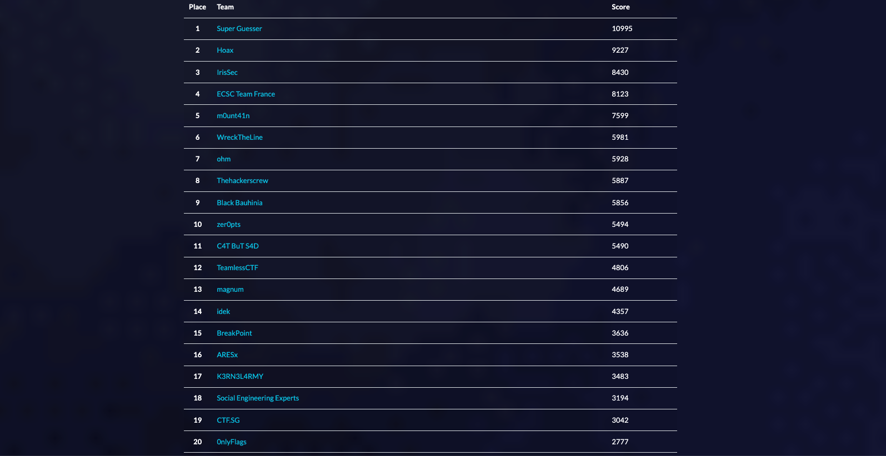
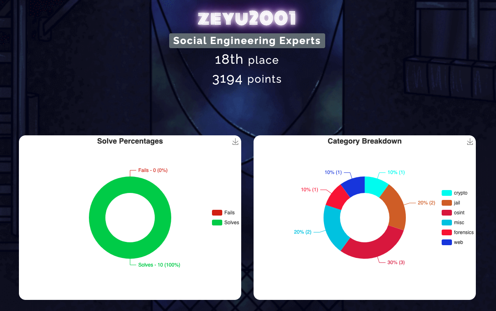
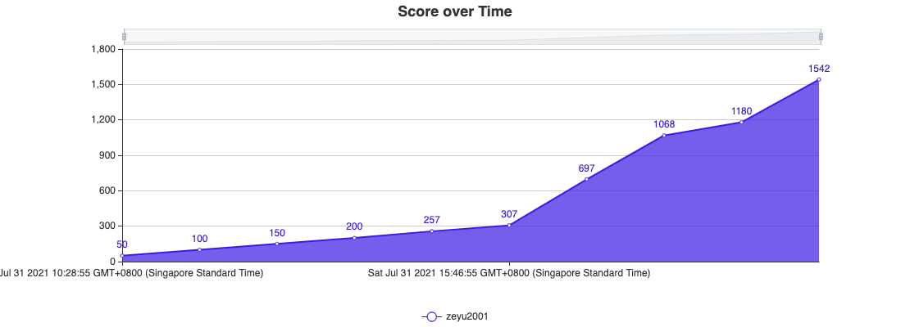
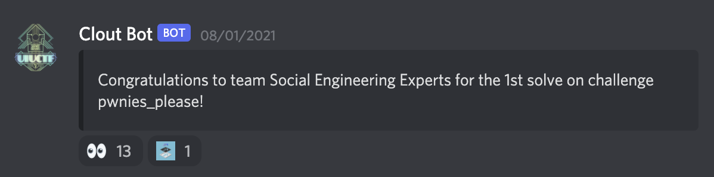

# UIUCTF 2021

This was my first time playing the annual UIUCTF, and I must say it was a really great experience. [Social Engineering Experts](https://ctftime.org/team/154571) ended in 18th place, out of 658 scoring teams.

I tried my hand at a variety of challenges across categories such as forensics and web exploitation.

It was a tough 48 hours, but the satisfaction from solving each challenge was definitely worth it! Glad that [Angmar](https://angmar2722.github.io/CTFwriteups/2021/uiuctf2021/) and I pushed through, solving two of the challenges way past midnight and a few hours before the CTF ended.

I also won a $100 bounty for the first blood on Pwnies Please, a machine learning challenge that required solvers to generate adversarial examples to fool an image classification model.

## Writeups

| Challenge | Category |
| :--- | :--- |
| [back\_to\_basics](back_to_basics.md) | crypto |
| [ponydb](ponydb.md) | web |
| yana | web |
| buy\_buy\_buy | misc |
| pwnies\_please | misc |
| Q-Rious Transmissions | misc |
| capture the :flag: | forensics |
| SUPER | forensics |

