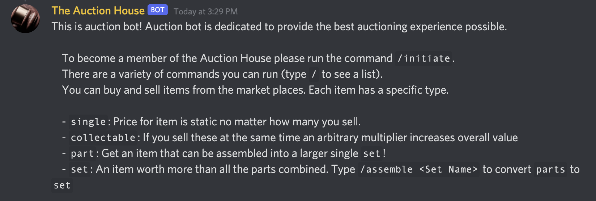
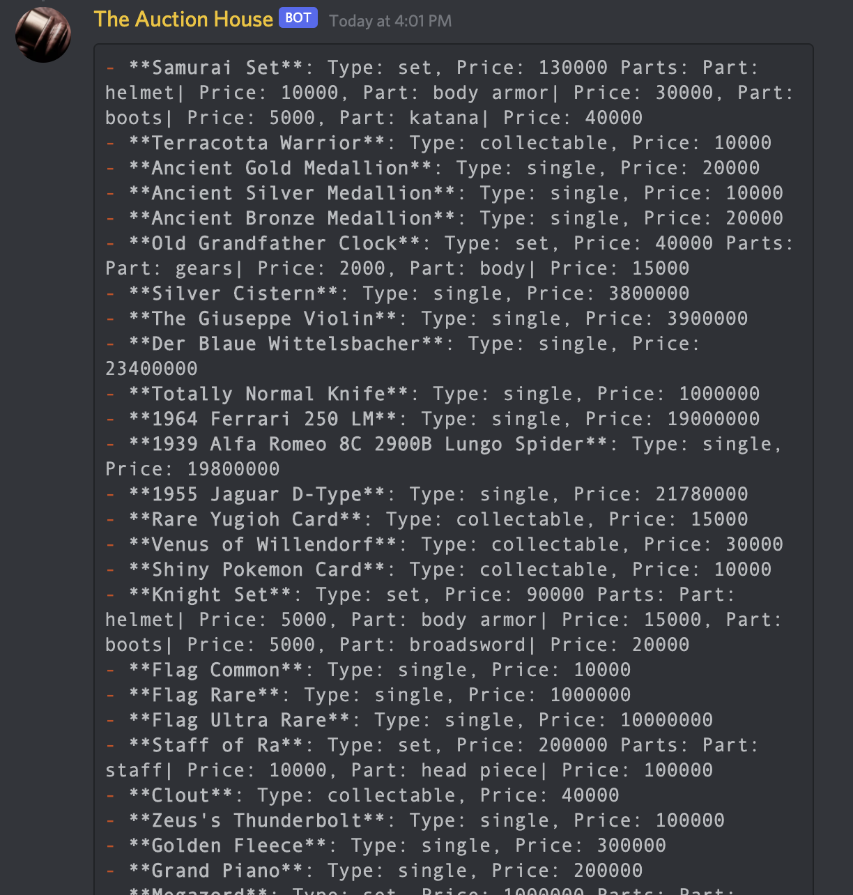
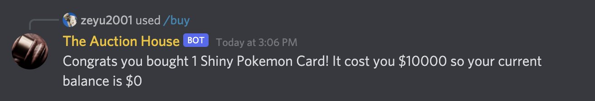
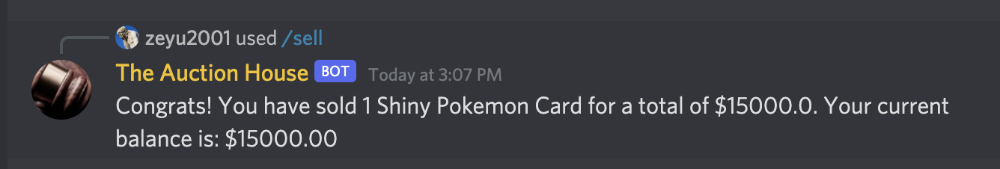
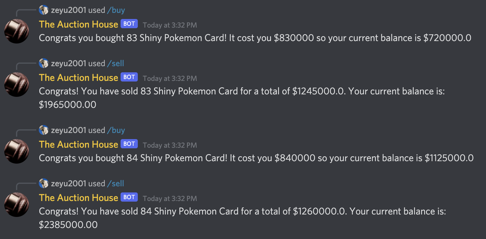
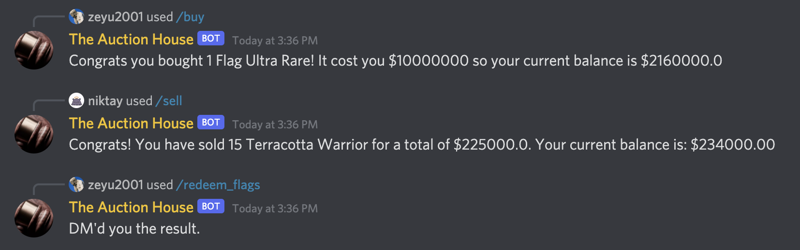
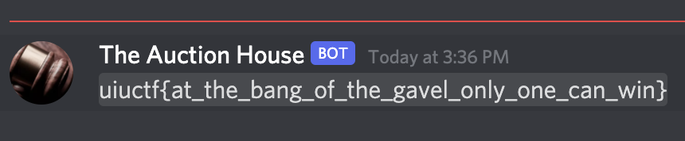

# buy\_buy\_buy

## Description

I got a lot of items to sell so buy buy buy.

Challenge Author: Pranav Goel

## Solution

There was an "auction bot" on Discord.

It sold different types of items \(single, collectable, part and set\). The value of a `single` item is static, a `collectable` item increases in value by an arbitrary multiplier when sold, and `parts` can be combined to form a `set` which is worth more than the sum of its parts!

To view the items being sold, we can use `/marketplace`. The goal is to get enough money to buy all three flags \(Flag Common, Flag Rare and Flag Ultra Rare\).

We start off with $10,000. While there are many paths to winning, my strategy ended up being repeatedly buying and selling the Shiny Pokemon Card item.

The first Shiny Pokemon Card was bought for $10,000, but when sold, it made an overall profit of $5000.

As our balance increases, we could buy and sell more items at a time, increasing the rate at which we earn more profit.

Repeat this enough times, and we get enough money for all three flags.

Use `/redeem_flags`, and the bot DMs us the flag!

