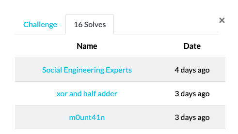

# pwnies\_please

## Description

Disguise these pwnies to get the flag!

http://pwnies-please.chal.uiuc.tf

note: first solve gets $100 from ian \(unintended solves don't count\)

**author**: Anusha Ghosh, Akshunna Vaishnav, ian5v, Vanilla

## Preface

Soon after the challenge was released, my teammate [rainbowpigeon](https://rainbowpigeon.netlify.app/posts/) told me to take a look at it since it was an image classification AI challenge and I have a fair bit of experience with computer vision tasks.

I didn't have any prior experience in attacking AI models, but this turned out to be a really fun task. I ended up getting the $100 bounty for the first solve on this challenge \(thanks Ian!\)



I learnt a lot about how machine learning models can be vulnerable to adversarial attacks, and hopefully you can learn something from reading my writeup too!

## Solution

The premise of the challenge was simple - we had to upload images to fool an image classification model, causing it to make inaccurate classifications.


### Source Code Analysis

The "bouncer" is a [ResNet-18](https://pytorch.org/hub/pytorch_vision_resnet/) image classification model that classifies a given image as one of 10 classes \('plane', 'car', 'bird', 'cat', 'deer', 'dog', 'frog', 'horse', 'ship', 'truck'\). This is the **non-robust** model that we have to fool, and we are given the model weights.

Another **robust** model, also using the ResNet-18 architecture, is used. This is meant to be the more accurate model, and serves as the [ground truth](https://en.wikipedia.org/wiki/Ground_truth).

```python
# ------------------ Model goes here ⬇------------------ #
imagenet_class_index = ['plane', 'car', 'bird', 'cat', 'deer', 'dog', 'frog', 'horse', 'ship', 'truck']
device = torch.device("cuda:0" if torch.cuda.is_available() else "cpu")

model_nonrobust = models.resnet18()
num_ftrs = model_nonrobust.fc.in_features
model_nonrobust.fc = nn.Linear(num_ftrs, len(imagenet_class_index))
model_nonrobust.load_state_dict(torch.load("./models/pwny_cifar_eps_0.pth", map_location = device))
model_ft = model_nonrobust.to(device)
model_nonrobust.eval()

model_robust = models.resnet18()
num_ftrs = model_robust.fc.in_features
model_robust.fc = nn.Linear(num_ftrs, len(imagenet_class_index))
model_robust.load_state_dict(torch.load("./models/pwny_cifar_eps_0.5.pth", map_location = device))
model_ft = model_robust.to(device)
model_robust.eval()

image_set = torchvision.datasets.CIFAR10(root='static/images', train=False, download=True)
# ------------------ Model goes here ------------------ #
```

The objective is to generate **adversarial examples** to fool the non-robust model into misclassifying the image as anything but a horse, while maintaining the "actual" class of the image so that the robust model still classifies the image as a horse.

```python
nonrobust = get_prediction(image_bytes=img_bytes, model = model_nonrobust, curr_image = session['img'])
robust = get_prediction(image_bytes=img_bytes, model = model_robust, curr_image = session['img'])
# robust model is the "ground truth", non-robust is the "bouncer"
# cases:
    # bouncer does not want to let in horses, you want to let them in anyway
    # robust says horse, non-robust says horse: you have been detected
    # robust says not horse, non-robust says horse: you fail extra hard
    # robust says horse, non-robust says not horse: flag
    # robust says not horse, non-robust says not horse: they were let in but you didn't achieve the goal
regen_image = True
if robust != 'horse':
    response = "you snuck SOMETHING into the club but it wasn't a pwny (changed too much, ground truth thinks image is a: robust {}\tnonrobust {})".format(robust, nonrobust)
    session['yolo'] += 1
elif robust == 'horse' and nonrobust != 'horse':
    session['level'] = session['level'] + 1
    session['yolo'] = 0
    response = "success! the bouncer thought your horse was a: {}".format(nonrobust)
    # response = "robust = {}, nonrobust = {}".format(robust, nonrobust)
else: # robust == 'horse' and nonrobust == 'horse': 
    response = "bouncer saw through your disguise. bouncer: rules say \"NO HORSEPLAY\""
    session['yolo'] += 1
    # response += "\nrobust {}\tnonrobust {}".format(robust, nonrobust)
    # this is the most common fail condition
if session['yolo'] > 3:
    session['yolo'] = 0
    session['level'] = 0
    response = "bouncer smacks you and you pass out, start over :)"
```

Every time we fool the model successfully, our "level" goes up by 1. More than three consecutive failed attempts, however, will set our "level" back to 0. We need to fool the model successfully 50 times, within 5 minutes.

```python
MIN_LEVEL = 50
SESSION_MINUTES = 5

...

if session['level'] >= MIN_LEVEL:
    response = FLAG
```

Additionally, `imagehash` is used to compare the relative closeness of the submitted image to the original image. The goal is to make _tiny_ changes to the original image, so that the non-robust model misclassifies the modified image.

```python
# Use imagehash to compare relative closeness of image (can't just allow random images to be thrown at the model...)
def get_prediction(image_bytes, model, curr_image = None):
    inputs = transform_image(image_bytes=image_bytes)
    outputs = model(inputs)
    preds = torch.argmax(outputs, 1)
    original = Image.open(io.BytesIO(base64.b64decode(curr_image)))

    # "where the magic happens" - akshunna
    input_image = Image.open(io.BytesIO(image_bytes))
    hash_orig = imagehash.average_hash(original)
    hash_input = imagehash.average_hash(input_image)

        # currently HASH_DIFFERENCE is 5
        # is number of bits changed in the hash
        # hash is 64 bits long
        # up to 5 hex digits can be different
        # 16 hex digits
        # 256b hash
        # 0xffff ffff ffff ffff ffff ffff ffff ffff
    if hash_orig - hash_input < HASH_DIFFERENCE:
        return imagenet_class_index[preds]
    else:
        return "IMAGE WAS TOO DIFFERENT"
```

### Backpropagation in Machine Learning

To understand the attack, we need a bit of machine learning theory. Neural networks are loosely inspired by the human brain. Like how the human brain is made up of neurons, neural networks are made up of **nodes**. These nodes span across multiple **layers**, starting from the input layer and ending at the output layer.


Nodes at each layer connect to nodes at the next layer. Each node represents some function $$f(x, w)$$ , where $$x$$ represents the input features and $$w$$ represents the **weight** of a node connection.

The "learning" takes place when the weights are updated, thus placing different priorities on different connections. Intuitively, these weights are what determines how much influence a particular input feature has on the final output.

When neural networks make a prediction, a **forward pass** is performed. This simply means calculating the output, $$y=f(x,w)$$ of each node. At the end of the forward pass, a **loss function** $$J$$ calculates the error between our predicted output and the actual output.

But in order for the model to learn, a **backward pass**, or **backpropagation**, must be performed. This might seem complicated, but it really isn't - it's just the [chain rule](https://en.wikipedia.org/wiki/Chain_rule)!

_OK,_ [_some people_](https://timvieira.github.io/blog/post/2017/08/18/backprop-is-not-just-the-chain-rule/) _won't be happy with the above statement, so maybe it's a little more subtle than that. You don't need to know this, but backpropagation is a special case of a technique known as automatic differentiation - as opposed to symbolic differentiation - which is a nice way of efficiently computing the derivative of a program with intermediate variables. I'll refer you to_ [_Justin Domke's notes_](https://people.cs.umass.edu/~domke/courses/sml2011/08autodiff_nnets.pdf) _for this._


Using the chain rule, we calculate the sensitivity of the loss to each of the inputs. This is repeated \(backpropagated\) through each node in the network. It might help to look at this as an optimization problem where the chain rule and memoization are used to save work calculating each of the local gradients.

This allows us to optimize the weights by performing a [gradient descent](https://www.kdnuggets.com/2017/10/neural-network-foundations-explained-gradient-descent.html). Intuitively, we want to find an optimal weight $$w$$ so that $$J(w)$$is minimized. To do this, we use the gradient calculated above - if $$\frac{\partial{J}}{\partial{w}} <0$$, we are going in the right direction. Otherwise, we have "overshot" our goal.


### Gradient-Based Attacks

What if, when backpropagating, instead of treating $$w$$ as the variable we want to optimize, we look at the input $$x$$ instead? Instead of minimizing the loss by adjusting the weights based on the backpropagated gradients, the attack **adjusts the input data to maximize the loss** based on the same backpropagated gradients.

The [Fast Gradient Sign Method \(FGSM\)](https://arxiv.org/abs/1412.6572) does this by applying a small pertubation to the original data, in the direction of increasing loss.


Intuitively, we are "nudging" the input in the "wrong direction", causing the model to make less accurate predictions.


### Exploitation

Back to the CTF challenge! We will implement the FSGM attack for this challenge.

First, we process the image, converting it to a Pytorch tensor and normalizing it.

```python
def get_adverserial_example(original_image):
    preprocess = transforms.Compose([
            transforms.ToTensor(),
            transforms.Normalize(
                [0.485, 0.456, 0.406],
                [0.229, 0.224, 0.225])])
    
    img = Image.open(original_image)
    image_tensor = preprocess(img)
    image_tensor = image_tensor.unsqueeze(0)
    img_variable = Variable(image_tensor, requires_grad=True)
```

We first perform a forward pass. The model predicts the class of the original image.

```python
    output = model_nonrobust.forward(img_variable)
    label_idx = torch.max(output.data, 1)[1][0]

    x_pred = imagenet_class_index[label_idx]

    output_probs = F.softmax(output, dim=1)
    x_pred_prob =  (torch.max(output_probs.data, 1)[0][0]) * 100
```

Next, we calculate the loss  $$J(x, y_{true})$$, where $$y_{true}$$ corresponds to the ground truth \(the label of 'horse'\). Performing a backward pass then calculates the gradient of each variable.

```python
    y_true = 7
    target = Variable(torch.LongTensor([y_true]), requires_grad=False)

    loss = torch.nn.CrossEntropyLoss()
    loss_cal = loss(output, target)
    loss_cal.backward(retain_graph=True)
```

Now that we have the gradients, we want to calculate the adversarial example as follows:

$$
x_{adv}=x+\epsilon \text{sign}(\nabla_xJ(x,y_{true}))
$$

This applies a perturbation of magnitude $$\epsilon$$ in the direction of increasing loss. 

The higher we set $$\epsilon$$, the less accurate the model will be **but** the perturbations become more easily perceptible. There is, therefore, a trade-off to consider between the relative closeness of the original and perturbed image, and the degree of accuracy degradation we can cause in the model's predictions. 

In this case, I found that `eps = 0.02` worked well enough \(perturbations are small enough that the two images are similar, and the loss is significant enough that the model misclassifies the results\)

```python
    eps = 0.02
    x_grad = torch.sign(img_variable.grad.data)
    x_adversarial = img_variable.data + eps * x_grad
```

We can then predict on the generated adversarial image to validate our results.

```python
    output_adv = model_nonrobust.forward(Variable(x_adversarial))
    x_adv_pred = imagenet_class_index[torch.max(output_adv.data, 1)[1][0]]
    op_adv_probs = F.softmax(output_adv, dim=1)
    adv_pred_prob =  (torch.max(op_adv_probs.data, 1)[0][0]) * 100
```

Let's visualize our results!

```python
def visualize(x, x_adv, x_grad, epsilon, clean_pred, adv_pred, clean_prob, adv_prob):
        
    x = x.squeeze(0)     # remove batch dimension # B X C H X W ==> C X H X W
    x = x.mul(torch.FloatTensor(std).view(3,1,1)).add(torch.FloatTensor(mean).view(3,1,1)).numpy()# reverse of normalization op- "unnormalize"
    x = np.transpose( x , (1,2,0))   # C X H X W  ==>   H X W X C
    x = np.clip(x, 0, 1)
    
    x_adv = x_adv.squeeze(0)
    x_adv = x_adv.mul(torch.FloatTensor(std).view(3,1,1)).add(torch.FloatTensor(mean).view(3,1,1)).numpy()# reverse of normalization op
    x_adv = np.transpose( x_adv , (1,2,0))   # C X H X W  ==>   H X W X C
    x_adv = np.clip(x_adv, 0, 1)
    
    x_grad = x_grad.squeeze(0).numpy()
    x_grad = np.transpose(x_grad, (1,2,0))
    x_grad = np.clip(x_grad, 0, 1)
    
    figure, ax = plt.subplots(1,3, figsize=(18,8))
    ax[0].imshow(x)
    ax[0].set_title('Clean Example', fontsize=20)
    
    
    ax[1].imshow(x_grad)
    ax[1].set_title('Perturbation', fontsize=20)
    ax[1].set_yticklabels([])
    ax[1].set_xticklabels([])
    ax[1].set_xticks([])
    ax[1].set_yticks([])

    
    ax[2].imshow(x_adv)
    ax[2].set_title('Adversarial Example', fontsize=20)
    
    ax[0].axis('off')
    ax[2].axis('off')

    ax[0].text(1.1,0.5, "+{}*".format(round(epsilon,3)), size=15, ha="center", 
            transform=ax[0].transAxes)
    
    ax[0].text(0.5,-0.13, "Prediction: {}\n Probability: {}".format(clean_pred, clean_prob), size=15, ha="center", 
        transform=ax[0].transAxes)
    
    ax[1].text(1.1,0.5, " = ", size=15, ha="center", transform=ax[1].transAxes)

    ax[2].text(0.5,-0.13, "Prediction: {}\n Probability: {}".format(adv_pred, adv_prob), size=15, ha="center", 
        transform=ax[2].transAxes)
    

    plt.show()
```

Great! After applying the perturbation, the model now thinks that the image is a dog.


Let's complete our `get_adverserial_example()` function by saving the adversarial example as `sol.png`.

```python
    x_adv = x_adversarial
    x_adv = x_adv.squeeze(0)
    x_adv = x_adv.mul(torch.FloatTensor(std).view(3,1,1)).add(torch.FloatTensor(mean).view(3,1,1)).numpy()#reverse of normalization op
    x_adv = np.transpose( x_adv , (1,2,0))   # C X H X W  ==>   H X W X C
    x_adv = np.clip(x_adv, 0, 1)

    plt.imsave('sol.png', x_adv)

    test_image = Image.open('sol.png').convert('RGB')
    test_image.save('sol.png')
```

All that's left now is the driver code for solving the CTF! 

I used Python's requests library to automate the downloading of the original images and the uploading of the adversarial examples.

```python
def main():

    s = requests.session()
    r = s.get('http://pwnies-please.chal.uiuc.tf/')
    print('Cookies:', r.cookies)

    curr_level = 0
    fail_count = 0
    while curr_level < 50 and 'uiuctf' not in r.text:

        print('Current Level:', curr_level)

        match = re.search('', r.text)
        img_data = base64.b64decode(match[1])
        filename = 'original_img.png'

        with open(filename, 'wb') as f:
            f.write(img_data)
        
        get_adverserial_example(filename)

        files = {'file': open('sol.png','rb')}

        r = s.post('http://pwnies-please.chal.uiuc.tf/?', files=files)

        if 'success' in r.text:
            print('[+] Success')
            curr_level += 1
            fail_count = 0
        
        else:
            print('[-] Failure')
            fail_count += 1
        
        if fail_count > 3:
            curr_level = 0
            fail_count = 0

    print('[+] Attack successful!')
    r = s.get('http://pwnies-please.chal.uiuc.tf/')
    print(r.text)

main()
```

The success rate should be quite reliable!


After 50 successful misclassifications, we get the flag.


### Full Solver Script



## Postface

I'm done with the CTF writeup, and at this point, I'm just writing/rambling out of passion. I've never learnt about adversarial attacks before, so this is all very new and cool to me - if you're like me and want to know more, feel free to read on!

### Why Should I Care?

This was just a CTF challenge, but there are plenty of real-life examples that highlight the severity of adversarial attacks.

For instance, [these adversarial examples](https://deepdrive.berkeley.edu/node/212) involve printed color stickers on road signs to fool DNN models used by self-driving cars - imagine causing an accident by simply placing a few stickers on stop signs! 


One might be tempted to use a "person detector" in a physical intrusion detection mechanism. But as [this paper](https://arxiv.org/abs/1904.08653) shows, such models can be easily fooled by the person's clothing.


### Bugs or Features?

Adversarial attacks and their defences are still a very active research topic. [One paper](https://arxiv.org/abs/1905.02175) argues that "[Adversarial Examples Aren't Bugs, They're Features](http://gradientscience.org/adv/)" - in brief, the researchers showed that the "non-robust" features imperceptible to humans might not be unnatural and meaningless, and are just as useful as perceptible "robust" ones in maximizing test-set accuracy.


When we make a small adversarial perturbation, we do not significantly affect the robust features, but flip the non-robust features. Since the model has no reason to prefer robust features over non-robust features, these seemingly small changes have a significant impact on the resulting output. When non-robust features are removed from the training set, it was found that robust models can be obtained with standard training.


Suppose an alien with no _human_ concepts of "similarity". It might be confused why the original and final images should be identically classified. Remember, this alien perceives images in a completely different way from how humans do - it would spot patterns that humans are oblivious to, yet are extremely predictive of the image's class.

It is thus argued that "adversarial examples" is a purely human phenomenon - without any context about the physical world and human-related concepts of similarity, both robust and non-robust features should appear equally valid to a model. After all, what is "robust" and "non-robust" is purely considered from the human point of view - a model does not know to prioritize human-perceivable features over non-human-perceivable ones.

This is a really interesting perspective - if robustness is an inherent property of the dataset itself, then the solution to achieving human-meaningful outcomes fundamentally stems from eliminating non-robust features during training.

