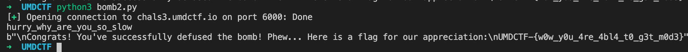

# Bomb 2 - Mix Up

Source code:

```python
import string
import random
import socket
import threading
from _thread import *
import time

FLAG = "REDACTED"
code = "REDACTED"
HOST = '0.0.0.0'  # Standard loopback interface address (localhost)
PORT = 12347        # Port to listen on (non-privileged ports are > 1023)

def threading(conn):
    conn.sendall(initial.encode())
    data = conn.recv(1024).decode()

    if data == "\n":
        values = give_values()
        print(values)
        print(('\n'.join(values)).encode())
        conn.sendall(('\n'.join(values)+'\n\nCode: ').encode())
        start_timer = time.perf_counter()
    else:
        conn.close()

    data = conn.recv(1024).decode().split('\n')[0]
    print(f'{data}\n{code}')
    end_timer = time.perf_counter()

    print("Start: {}\nFinish: {}\nExcecution Time: {}".format(start_timer, end_timer, int(end_timer - start_timer)))

    if data and data in code:
        if int(end_timer - start_timer) <= 5:
            conn.sendall("\nCongrats! You've successfully defused the bomb! Phew... Here is a flag for our appreciation:\n{}".format(FLAG).encode())
        else:
            conn.sendall("That took more than 5 seconds :(".encode())
    else:
        conn.sendall("That was wrong :(".encode())
    print('closing connection to', addr)
    conn.close()

def print_mode(mstring):
    print(max(set(mstring), key=mstring.count))

def generate_string():
    possible = string.ascii_lowercase + string.ascii_lowercase + string.digits + '_-{}'
    return [random.choice(possible) for i in range(1000)]

def give_values():
    total = []
    for i in range(len(code)):
        test = generate_string()
        c = code[i]
        for i in range(100):
            num = random.randint(0,999)
            test[num] = c
        total.append(''.join(test))
    return total

initial = "Hurry someone lost the code that stops the bomb! Find and decode it. Time is running out...\n\nPress Enter to begin"

with socket.socket(socket.AF_INET, socket.SOCK_STREAM) as s:
    s.bind((HOST, PORT))
    s.listen()
    while True:
        conn, addr = s.accept()
        print("\n")
        start_new_thread(threading, (conn, ))
    s.close()
```

Analysing the `give_values()` function, we can see that every line of data generated corresponds to one character in the `code`, and that this character will appear very frequently \(~100 times\) in that line of data. The key is therefore to maintain a frequency dictionary and extract the most frequent character for each line.

```python
from pwn import *

conn = remote('chals3.umdctf.io', 6000)

conn.recv()
conn.send('\n')
data = conn.recvuntil('Code').decode()

lines = data.split('\n')[:-1]

chars = []

for line in lines:

    if line and 'Code' not in line:

        freq_dict = {}
        for char in line:
            if char in freq_dict:
                freq_dict[char] += 1
            else:
                freq_dict[char] = 0

        freq_dict = {k: v for k, v in sorted(freq_dict.items(), key=lambda item: -item[1])}
        most_freq = list(freq_dict.keys())[0]

        chars.append(most_freq)

print(''.join(chars))
conn.send(''.join(chars))
conn.recv()
print(conn.recv())
```



