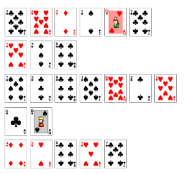

# Cards Galore

The cards spell out a message \(Mirdek card cipher\).

Reference: [http://www.ciphergoth.org/crypto/mirdek/description.html](http://www.ciphergoth.org/crypto/mirdek/description.html)

HVOBYG TCF GCFHWBU AM QOFRG

Caesar Cipher, translates to:

THANKS FOR SORTING MY CARDS

