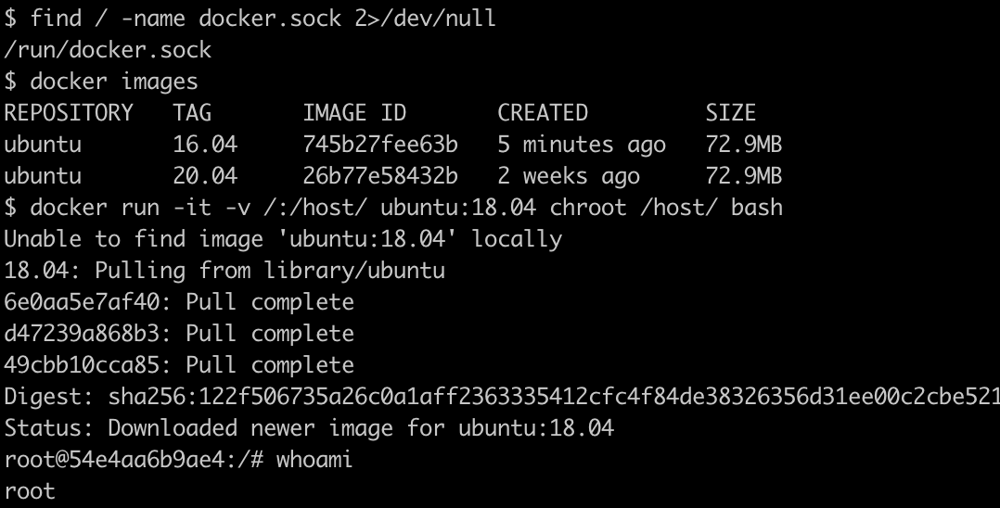
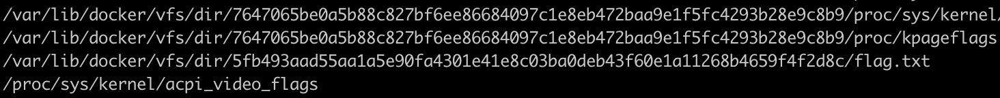
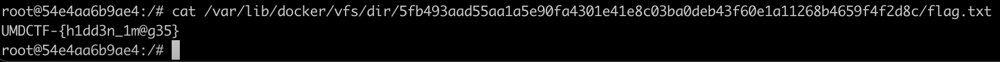

# Donnie Docker

## Problem

I found this weird machine online, looks like they're using docker for security but I'm not sure their OPSEC is as good as they think!

`ssh user@chals2.umdctf.io -p 5000 password: umdctf`

## Solution

Reference: [https://book.hacktricks.xyz/linux-unix/privilege-escalation/docker-breakout](https://book.hacktricks.xyz/linux-unix/privilege-escalation/docker-breakout)

The docker socket is mounted inside the docker container. This allows us to run regular docker commands to communicate with the docker daemon, for instance mounting the host disk, and chroot-ing to it.

We find the flag.txt here:

Obtaining our flag:

