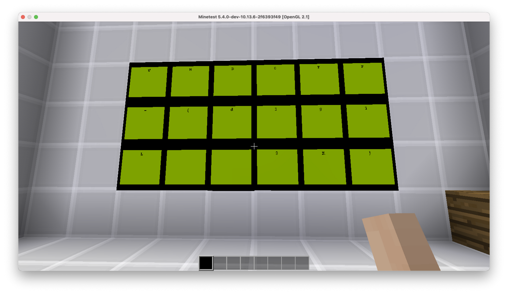

# Minetest

This was a series of logic circuit challenges in Minetest.

Sidenote: It was a really fun challenge!


## Part 1

A simple logic circuit, control the inputs so that the output is True.

UMDCTF{d...}

## Part 2

```text
the light-up walls have nothing to do with this - use the yellow-ish lamps on the walls
```

XOR the top and bottom lamps.

10110 XOR 01101 = 11011

UMDCTF-{d1g...}

## Part 3

```text
The output may "twitch" a little bit - make sure to only record the long pauses
Find the input from the output
Push button to start sequence; the sequence will end with three quick "on" bursts; the frequency of input is ~1 sec
3 inputs. 2 outputs. For each output burst, there is a combination of inputs a, b, and c. Inputs will be strung together to make something like "abcabcabcabc...." and so on. There should be enough to make bytes of data for the input.
```

Observe the inputs, and note down which inputs are True for each 'pulse'. The `PAUSE` inputs mean that none of the inputs is True.

```text
b
c
a
abc
b
ac
ac
a
bc
bc
PAUSE
a
PAUSE
ac
a
a
------- ENDING SIGNAL
abc
abc
abc
```

Translate this to binary:

010 001 100 111 010 101 101 100 011 011 000 100 000 101 100 100

Then, convert the binary to ASCII.

ANSWER: FullAd

UMDCTF-{d1g1...}

## Part 4

```text
c
ac
PAUSE
abc
b
PAUSE
ab
bc
b
PAUSE
a
bc
PAUSE
ac
ab
a
```

Translate this to binary:

001 101 000 111 010 000 110 011 010 000 100 011 000 101 110 100

Then, convert the binary to ASCII.

ANSWER: 4t3b1t

UMDCTF{d1g1L...}

## Part 5

```text
Which letter combinations have an "on" output? These will be in ASCII and you can put them in any order when submitting
Enter the correct ASCII chacracters to receive a part of the flag. Make sure to hit "Execute"!
Exclude the "{"
This will be in binary, then translated to ascii.
```

Let the bits be: a b c d e f g h \(from MSB to LSB\). Analyse the circuit to come up with a boolean expression:

\(\(f XOR h\) . \( \(a XOR c\) . \( ~\(e XOR h\) . \(~a . b\) \) \)\) . \(~\(g XOR d\)\)

Simplify:

f XOR h . a XOR c . ~\(e XOR h\) . ~a . b . ~\(g XOR d\)

Since a=0 and b=1, and a XOR c, then c=1

Since ~\(e XOR h\) and ~\(g XOR d\), e = h and g = d.

a, b, c are fixed, so there are only 4 possible combinations \(e = h = either 0 or 1, g = d = either 0 or 1, f = ~h\)


ANSWER: div

UMDCTF{...3k}

From here we can kinda guess the flag: d1g1L0g3k. It worked!

\(I probably didn't get the full solution, but this is good enough I guess...\)



