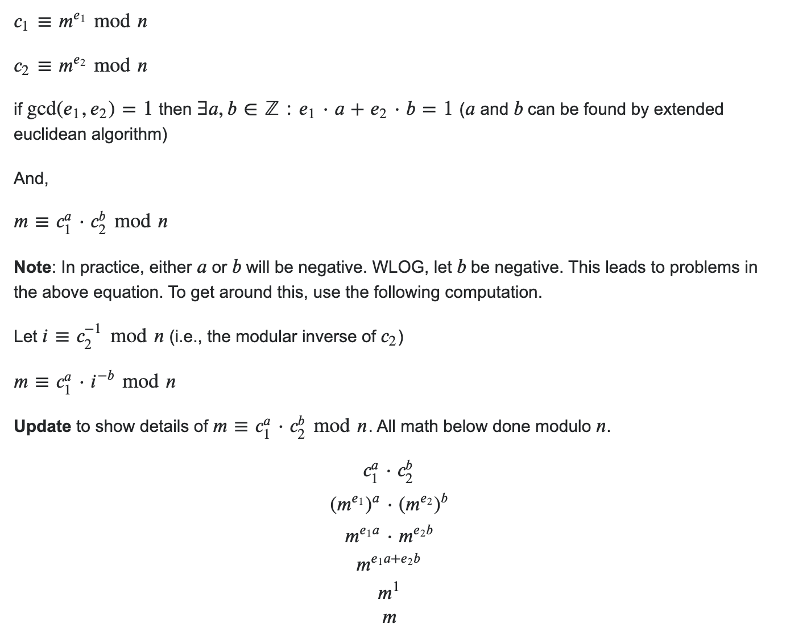

# Office Secrets

## Problem

David and George have been sharing secrets in the office. They have been using RSA, but every time they send messages to each other they send the same message twice with different e&d pairs.

## Theory

Since we know e1 and e2, we can crack the plaintext. The mathematical proof is below:



Reference: [https://crypto.stackexchange.com/questions/1614/rsa-cracking-the-same-message-is-sent-to-two-different-people-problem](https://crypto.stackexchange.com/questions/1614/rsa-cracking-the-same-message-is-sent-to-two-different-people-problem)

We can get a and b using the Extended Euclidean Algorithm.

## Solution

```python
from Crypto.Util.number import long_to_bytes

n = 821145496340604994326551113777327586712517116620710138023054342574561508685841651221395336923009432483632922988810280492233212938499610799302600039372236950091107415608469420373862484991247563501588476379781833166384349047256248750305151647368869191030962402077545654309677921204852761327474210545126231678365653938950875121407802825449417647436581800984094019773441138824103100874107518637740157619401903676758887305144344197013469731097784600887460586080710165172482576075554962211636042250812985660796823586807936400193119329788414901163974273519389637577743274602328794149195160641844665952005304891539239569281271190359677800733335753851272087825367905649608365380311871961227784025384860567980372211829089046263037976143489649037301004190176743451524855021975173331377848869766803669380738028850423188441730950930293351831551235608896471056414832724437298313834205316903183915777214359716054610505148862937481302816735818707845634855944420246486170440894211568345806270149624349863659569587253363399011002661439234940175509430324800131974720796290147011359912907511800794856022323351326527433065369890076901244769188559744857014437935275331668815662843342949028524668792900934778393081540969378177946315133482100129146436669233497
e1 = 65537
e2 = 65541
c1 = 780658436829916376849384953245046160585006566851042012704483209702863678062476060756861957431999166629960572489603381700463275558025911158723111813760955911506337953716534563343115021823289248053271415861008199599068709619941387500593662710034484419278437304369245662463380173948899883854712600886743561289754388478767465223935093798360125367362879875535793567716252747828959165300728670927677586083626110399715409764034270617075449717200906494499007185580184170259914847655677050502720118962936087740966849768882421990167461773397556896691265675635559329081186546667946536578010983532961277846787291599634467295299791558850634527709927175609022598253337622813256745216579309329227079025559132092995655055119144058999133469290767315748585571388688867103997098949375862975626251519059108022935941373746765178464580101421855461208548905080081593390398889796527136710377487129081581831121286368672927500388994836835845435585150657365737164257330248359564521338736375940961805472256343202225082865355879734551573811089188154855414127614241972020512898828117635938918343107026058446893772322369436471625258214860657502565115735633197652559346691974162384457065240574498012155398418564013515671469264618447355250305094991187170237948576532077
c2 = 735256250724848919984419549223350440687010098689497431056824014318841425273065986563198012277778606699050926497774004587167419278887354216966505104389832590247499586117280759436568682554909948301402068424408481233976792164353363568704843297902646179376701101900716343576808207672817119703685570017152992516703199387294606025366214936169620062431844539552660353581055307719518672730666646883176367112225249117457203626111247753957934293964536347814602877293954317021311068194603103261553902983633945548264531851583976628406674945528700774166193949004095627256850179767579796266297204984826579278250065231424113006680578898890762351089566765496523085076722100692059011518474695680484208750408305954465250291735352661456585824028043147958682132602952760603303724587765805310693061276622110845551989485749458552976541846731437090553929509382776662651311781608275507521192811542982284336804252667371580739212453551948383592762228515781281038213490066164297052624301734231340763458124727723598624463430414991981456321144843359843333762263992265225858385273530114542865878399383406365897452952175231015883782841247741656618056534670777373786071766344721200071296309102595821678398629910918245754738867818121283533241588042800700371495337081540

def gcdExtended(a, b):  

    # Base Case  
    if a == 0 :   
        return b, 0, 1

    gcd, x1, y1 = gcdExtended(b%a, a)  

    # Update x and y using results of recursive  
    # call  
    x = y1 - (b//a) * x1  
    y = x1  

    return gcd, x, y 

gcd, a, b = gcdExtended(e1, e2)
print(gcd, a, b)

result = (pow(c1, a, n) * pow(c2, b, n)) % n
print(result)

print(long_to_bytes(result))
```


