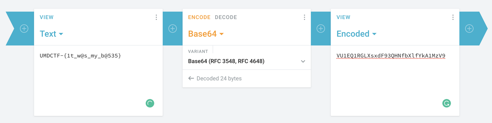

# Whose Base Is It Anyway

## Problem

Someone gave this ciphertext but I'm not sure how to solve it or what they based it off of. Seems tricky but can you figure it out?

## Solution

From first glance, we can see that the cipher is full of `A`s and `B`s. This is binary, i.e. base 2. After we decode this, we will get another string with `A`s, `B`s, `C`s and `D`s. This would be base 4.

This continues until base 64, where we are finally able to obtain our flag \(base 64 decode\).


Note that for base 32, we are using a custom alphabet.


Base 64 decode the obtained string:



Script:

```python
from Crypto.Util.number import long_to_bytes
import base64

cipher = "ABAAAABAABAAAAABABAAAAABABAAABAAABAAAABAABAAAAABABAAAAABABAAAABBABAAAABAABAAAAABABAAAAABABAAABAAABAAAABAABAAAAABABAAAABAABAAAABAABAAAABAABAAAAABABAAAABAABAAABAAABAAAABAABAAAAABABAAAAABABAAAABBABAAAABAABAAAAABABAAAAABABAAAABAABAAAABAABAAAAABABAAAABAABAAABAAABAAAABAABAAAAABABAAAAABABAAABAAABAAAABAABAAAAABABAAAAABABAAABAAABAAAABAABAAAAABABAAAABAABAAABAAABAAAABAABAAAAABABAAAABAABAAAABAABAAAABAABAAAAABABAAAAABABAAABAAABAAAABAABAAAAABABAAAABAABAAAABBABAAAABAABAAAAABABAAAAABABAAAABBABAAAABAABAAAAABABAAAABAABAAAABAABAAAABAABAAAAABABAAAAABABAAABAAABAAAABAABAAAAABABAAAAABABAAAABBABAAAABAABAAAAABABAAAABAABAAAABAABAAAABAABAAAAABABAAAABAABAAAABAABAAAABAABAAAAABABAAAAABABAAABAAABAAAABAABAAAAABABAAAABAABAAAABBABAAAABAABAAAAABABAAAAABABAAAABAABAAAABAABAAAAABABAAAABAABAAAABBABAAAABAABAAAAABABAAAAABABAAABAAABAAAABAABAAAAABABAAAAABABAAAABBABAAAABAABAAAAABABAAAAABABAAAABAABAAAABAABAAAAABABAAAABAABAAAABAABAAAABAABAAAAABABAAAABAABAAAAABABAAAABAABAAAAABABAAAAABABAAAABBABAAAABAABAAAAABABAAAAABABAAAABAABAAAABAABAAAAABABAAAABAABAAAAABABAAAABAABAAAAABABAAAAABABAAABAAABAAAABAABAAAAABABAAAAABABAAAABBABAAAABAABAAAAABABAAAAABABAAABAAABAAAABAABAAAAABABAAAABAABAAAABAABAAAABAABAAAAABABAAAABAABAAABAAABAAAABAABAAAAABABAAAAABABAAAABBABAAAABAABAAAAABABAAAAABABAAAABAABAAAABAABAAAAABABAAAABAABAAABAAABAAAABAABAAAAABABAAAAABABAAABAAABAAAABAABAAAAABABAAAAABABAAAABAABAAAABAABAAAAABABAAAABAABAAABAAABAAAABAABAAAAABABAAAABAABAAAABAABAAAABAABAAAAABABAAAAABABAAABAAABAAAABAABAAAAABABAAAABAABAAAABBABAAAABAABAAAAABABAAAAABABAAAABBABAAAABAABAAAAABABAAAAABABAAAABAABAAAABAABAAAAABABAAAAABABAAABAAABAAAABAABAAAAABABAAAAABABAAAABBABAAAABAABAAAAABABAAAAABABAAABAAABAAAABAABAAAAABABAAAABAABAAAABAABAAAABAABAAAAABABAAAABAABAAAAABABAAAABAABAAAAABABAAAABAABAAAABBABAAAABAABAAAAABABAAAAABABAAAABAABAAAABAABAAAAABABAAAABAABAAAABBABAAAABAABAAAAABABAAAAABABAAABAAABAAAABAABAAAAABABAAAAABABAAABAAABAAAABAABAAAAABABAAAABAABAAABAAABAAAABAABAAAAABABAAAABAABAAAABAABAAAABAABAAAAABABAAAAABABAAABAAABAAAABAABAAAAABABAAAABAABAAAABBABAAAABAABAAAAABABAAAAABABAAAABAABAAAABAABAAAAABABAAAABAABAAABAAABAAAABAABAAAAABABAAAAABABAAABAAABAAAABAABAAAAABABAAAAABABAAAABBABAAAABAABAAAAABABAAAAABABAAABAAABAAAABAABAAAAABABAAAABAABAAAABBABAAAABAABAAAAABABAAAAABABAAAABAABAAAABAABAAAAABABAAAAABABAAAABBABAAAABAABAAAAABABAAAAABABAAAABAABAAAABAABAAAAABABAAAABAABAAABAAABAAAABAABAAAAABABAAAAABABAAABAAABAAAABAABAAAAABABAAAAABABAAAABBABAAAABAABAAAAABABAAAAABABAAABAAABAAAABAABAAAAABABAAAABAABAAAABAABAAAABAABAAAAABABAAAAABABAAABAAABAAAABAABAAAAABABAAAABAABAAAABBABAAAABAABAAAAABABAAAAABABAAAABAABAAAABAABAAAAABABAAAABAABAAAABAABAAAABAABAAAAABABAAAAABABAAABAAABAAAABAABAAAAABABAAAAABABAAAABBABAAAABAABAAAAABABAAAABAABAAAABAABAAAABAABAAAAABABAAAABAABAAAABAABAAAABAABAAAAABABAAAABAABAAAABBABAAAABAABAAAAABABAAAAABABAAAABBABAAAABAABAAAAABABAAAAABABAAAABAABAAAABAABAAAAABABAAAABAABAAAABBABAAAABAABAAAAABABAAAAABABAAABAAABAAAABAABAAAAABABAAAABAABAAAABAABAAAABAABAAAAABABAAAAABABAAAABAABAAAABAABAAAAABABAAAABAABAAAABAABAAAABAABAAAAABABAAAAABABAAABAAABAAAABAABAAAAABABAAAABAABAAAABBABAAAABAABAAAAABABAAAAABABAAAABBABAAAABAABAAAAABABAAAABBABAAAAABABAAAABAABAAAAABABAAAAABABAAABAAABAAAABAABAAAAABABAAAAABABAAAABBABAAAABAABAAAAABABAAAABAABAAABAAABAAAABAABAAAAABABAAAABAABAAAABAABAAAABAABAAAAABABAAAAABABAAABAAABAAAABAABAAAAABABAAAAABABAAAABBABAAAABAABAAAAABABAAAAABABAAAABAABAAAABAABAAAAABABAAAABAABAAAABBABAAAABAABAAAAABABAAAAABABAAABAAABAAAABAABAAAAABABAAAAABABAAABAAABAAAABAABAAAAABABAAAAABABAAAABAABAAAABAABAAAAABABAAAABAABAAAABAABAAAABAABAAAAABABAAAAABABAAABAAABAAAABAABAAAAABABAAAABAABAAAABBABAAAABAABAAAAABABAAAAABABAAAABBABAAAABAABAAAAABABAAAAABABAAABAAABAAAABAABAAAAABABAAAAABABAAABAAABAAAABAABAAAAABABAAAAABABAAAABBABAAAABAABAAAAABABAAAABAABAAAABAABAAAABAABAAAAABABAAAABAABAAAABAABAAAABAABAAAAABABAAAAABABAAAABBABAAAABAABAAAAABABAAAABAABAAAABBABAAAABAABAAAAABABAAAAABABAAAABAABAAAABAABAAAAABABAAAABAABAAABAAABAAAABAABAAAAABABAAAAABABAAABAAABAAAABAABAAAAABABAAAAABABAAAABAABAAAABAABAAAAABABAAAABAABAAABAAABAAAABAABAAAAABABAAAABAABAAAABAABAAAABAABAAAAABABAAAABAABAAAAABABAAAABAABAAAAABABAAAAABABAAAABBABAAAABAABAAAAABABAAAAABABAAAABBABAAAABAABAAAAABABAAAABAABAAAAABABAAAABAABAAAAABABAAAAABABAAABAAABAAAABAABAAAAABABAAAAABABAAAABBABAAAABAABAAAAABABAAAAABABAAABAAABAAAABAABAAAAABABAAAABAABAAAABAABAAAABAABAAAAABABAAAABAABAAAABAABAAAABAABAAAAABABAAAAABABAAAABBABAAAABAABAAAAABABAAAAABABAAAABAABAAAABAABAAAAABABAAAABAABAAAABBABAAAABAABAAAAABABAAAAABABAAABAAABAAAABAABAAAAABABAAAABAABAAAAABABAAAABAABAAAAABABAAAABAABAAABAAABAAAABAABAAAAABABAAAABAABAAAABAABAAAABAABAAAAABABAAAAABABAAABAAABAAAABAABAAAAABABAAAABAABAAAABBABAAAABAABAAAAABABAAAAABABAAAABBABAAAABAABAAAAABABAAAAABABAAABAAABAAAABAABAAAAABABAAAAABABAAABAAABAAAABAABAAAAABABAAAAABABAAAABBABAAAABAABAAAAABABAAAABAABAAAABAABAAAABAABAAAAABABAAAABAABAAAABAABAAAABAABAAAAABABAAAABAABAAAAABABAAAABAABAAAAABABAAAAABABAAAABBABAAAABAABAAAAABABAAAAABABAAAABAABAAAABAABAAAAABABAAAABAABAAABAAABAAAABAABAAAAABABAAAAABABAAABAAABAAAABAABAAAAABABAAAAABABAAAABAABAAAABAABAAAAABABAAAABAABAAAABAABAAAABAABAAAAABABAAAABAABAAAABAABAAAABAABAAAAABABAAAABAABAAAAABABAAAABAABAAAAABABAAAAABABAAAABBABAAAABAABAAAAABABAAAAABABAAAABAABAAAABAABAAAAABABAAAABAABAAAABBABAAAABAABAAAAABABAAAAABABAAABAAABAAAABAABAAAAABABAAAAABABAAAABBABAAAABAABAAAAABABAAAABAABAAAABAABAAAABAABAAAAABABAAAABAABAAAABAABAAAABAABAAAAABABAAAAABABAAABAAABAAAABAABAAAAABABAAAABAABAAAABBABAAAABAABAAAAABABAAAAABABAAAABAABAAAABAABAAAAABABAAAABAABAAAABBABAAAABAABAAAAABABAAAAABABAAABAAABAAAABAABAAAAABABAAAAABABAAABAAABAAAABAABAAAAABABAAAAABABAAAABAABAAAABAABAAAAABABAAAABAABAAAABAABAAAABAABAAAAABABAAAAABABAAABAAABAAAABAABAAAAABABAAAABAABAAAABBABAAAABAABAAAAABABAAAAABABAAAABBABAAAABAABAAAAABABAAAABAABAAABAAABAAAABAABAAAAABABAAAAABABAAABAAABAAAABAABAAAAABABAAAAABABAAAABBABAAAABAABAAAAABABAAAAABABAAABAAABAAAABAABAAAAABABAAAABAABAAAABAABAAAABAABAAAAABABAAAABAABAAAABBABAAAABAABAAAAABABAAAABAABAAAABBABAAAABAABAAAAABABAAAAABABAAAABAABAAAABAABAAAAABABAAAABAABAAAABBABAAAABAABAAAAABABAAAAABABAAABAAABAAAABAABAAAAABABAAAABAABAAAAABABAAAABAABAAAAABABAAAABAABAAAABAABAAAABAABAAAAABABAAAABAABAAAABAABAAAABAABAAAAABABAAAAABABAAABAAABAAAABAABAAAAABABAAAABAABAAAABBABAAAABAABAAAAABABAAAAABABAAAABBABAAAABAABAAAAABABAAAAABABAAAABAABAAAABAABAAAAABABAAAAABABAAABAAABAAAABAABAAAAABABAAAAABABAAAABBABAAAABAABAAAAABABAAAABAABAAAABAABAAAABAABAAAAABABAAAABAABAAAABAABAAAABAABAAAAABABAAAABAABAAAABBABAAAABAABAAAAABABAAAAABABAAAABBABAAAABAABAAAAABABAAAAABABAAAABAABAAAABAABAAAAABABAAAABAABAAABAAABAAAABAABAAAAABABAAAAABABAAABAAABAAAABAABAAAAABABAAAAABABAAABAAABAAAABAABAAAAABABAAAABAABAAABAAABAAAABAABAAAAABABAAAABAABAAAABAABAAAABAABAAAAABABAAAABAABAAAAABABAAAABAABAAAAABABAAAAABABAAAABBABAAAABAABAAAAABABAAAAABABAAAABAABAAAABAABAAAAABABAAAABAABAAAABAABAAAABAABAAAAABABAAAAABABAAABAAABAAAABAABAAAAABABAAAAABABAAAABBABAAAABAABAAAAABABAAAABAABAAAABAABAAAABAABAAAAABABAAAABAABAAAABAABAAAABAABAAAAABABAAAABAABAAAABBABAAAABAABAAAAABABAAAABAABAAAABBABAAAABAABAAAAABABAAAAABABAAAABAABAAAABAABAAAAABABAAAABAABAAAABBABAAAABAABAAAAABABAAAAABABAAABAAABAAAABAABAAAAABABAAAABAABAAAAABABAAAABAABAAAAABABAAAABAABAAABAAABAAAABAABAAAAABABAAAABAABAAAABAABAAAABAABAAAAABABAAAAABABAAABAAABAAAABAABAAAAABABAAAABAABAAAABBABAAAABAABAAAAABABAAAAABABAAAABBABAAAABAABAAAAABABAAAABBABAAAAABABAAAABAABAAAAABABAAAAABABAAABAAABAAAABAABAAAAABABAAAAABABAAAABBABAAAABAABAAAAABABAAAAABABAAABAAABAAAABAABAAAAABABAAAABAABAAAABAABAAAABAABAAAAABABAAAAABABAAAABBABAAAABAABAAAAABABAAAAABABAAAABBABAAAABAABAAAAABABAAAAABABAAAABAABAAAABAABAAAAABABAAAABAABAAABAAABAAAABAABAAAAABABAAAAABABAAABAAABAAAABAABAAAAABABAAAAABABAAAABBABAAAABAABAAAAABABAAAAABABAAABAAABAAAABAABAAAAABABAAAABAABAAAABAABAAAABAABAAAAABABAAAAABABAAABAAABAAAABAABAAAAABABAAAABAABAAAABBABAAAABAABAAAAABABAAAAABABAAAABAABAAAABAABAAAAABABAAAABAABAAAABAABAAAABAABAAAAABABAAAAABABAAABAAABAAAABAABAAAAABABAAAAABABAAAABBABAAAABAABAAAAABABAAAABAABAAAABAABAAAABAABAAAAABABAAAABAABAAAABAABAAAABAABAAAAABABAAAAABABAAABAAABAAAABAABAAAAABABAAAABAABAAAABBABAAAABAABAAAAABABAAAAABABAAAABAABAAAABAABAAAAABABAAAABAABAAAABBABAAAABAABAAAAABABAAAAABABAAABAAABAAAABAABAAAAABABAAAABAABAAAAABABAAAABAABAAAAABABAAAAABABAAABAAABAAAABAABAAAAABABAAAABAABAAAABAABAAAABAABAAAAABABAAAABAABAAAAABABAAAABAABAAAAABABAAAABAABAAAABBABAAAABAABAAAAABABAAAAABABAAAABAABAAAABAABAAAAABABAAAAABABAAABAAABAAAABAABAAAAABABAAAAABABAAABAAABAAAABAABAAAAABABAAAAABABAAAABBABAAAABAABAAAAABABAAAAABABAAABAAABAAAABAABAAAAABABAAAABAABAAAABAABAAAABAABAAAAABABAAAABAABAAABAAABAAAABAABAAAAABABAAAAABABAAAABBABAAAABAABAAAAABABAAAAABABAAAABAABAAAABAABAAAAABABAAAABAABAAABAAABAAAABAABAAAAABABAAAAABABAAABAAABAAAABAABAAAAABABAAAAABABAAABAAABAAAABAABAAAAABABAAAABAABAAAABAABAAAABAABAAAAABABAAAABAABAAAABAABAAAABAABAAAAABABAAAABAABAAAAABABAAAABAABAAAAABABAAAABAABAAAABBABAAAABAABAAAAABABAAAAABABAAAABAABAAAABAABAAAAABABAAAABAABAAAABAABAAAABAABAAAAABABAAAAABABAAABAAABAAAABAABAAAAABABAAAAABABAAAABBABAAAABAABAAAAABABAAAABAABAAAABAABAAAABAABAAAAABABAAAABAABAAAABAABAAAABAABAAAAABABAAAAABABAAAABBABAAAABAABAAAAABABAAAAABABAAAABA"

def converter(figures, base):

    #invert oder of figures (lowest count first)
    figures = figures[::-1]
    result = 0
    #loop over all figures
    for i in range(len(figures)):
        #add the contirbution of the i-th figure
        result += figures[i]*base**i
    return result

curr_base = 2

print(cipher)

done = False
while not done:

    figures = []
    for char in cipher:

        if char.islower() :
            figures.append(26 + ord(char) - ord('a'))

        elif ord(char) >= ord('A'):
            diff = ord(char) - ord('A')
            figures.append(diff)

    while len(figures) % 8:
        figures.append(0)

    converted = converter(figures, curr_base)

    result = long_to_bytes(converted)
    # print(result)
    cipher = result.decode()

    print(curr_base)
    print(cipher)

    curr_base *= 2

    if curr_base == 64:
        break
```

