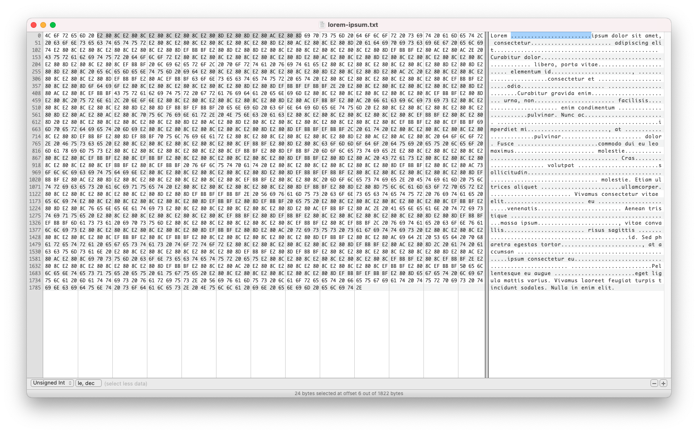

# Lorem-Ipsum

## Description

We found this text classified as "Top secret". But we found an ordinary placeholder there. What is the secret?



## Solution

Opening up the file in a hex editor, we can see that there are many zero-width characters hidden in the spaces. This is zero-width steganography, and each of the zero-width characters contain encoded data.

Luckily for us, there is a [site](https://330k.github.io/misc_tools/unicode_steganography.html) that implements the decoding for us. We only need to paste the encoded text.

The flag is `YauzaCTF{1_c4n_h1d3_wh473v3r_y0u_w4n7_3v3rywh3r3}`.

