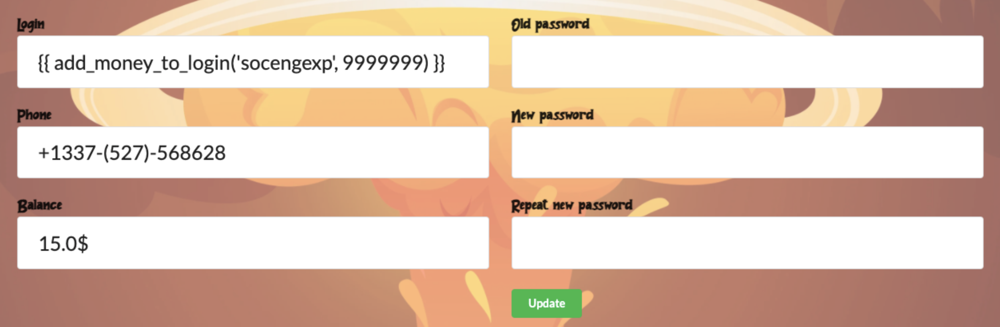
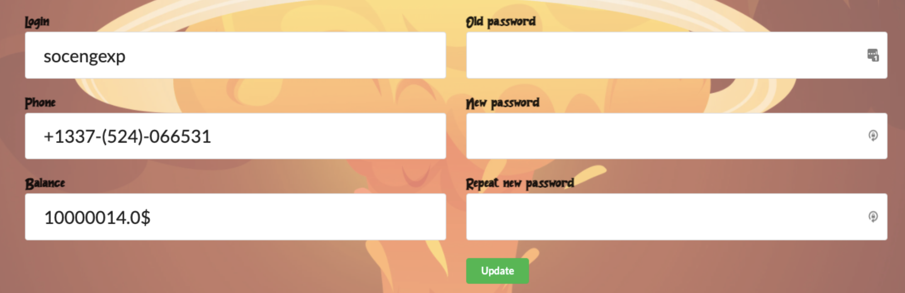
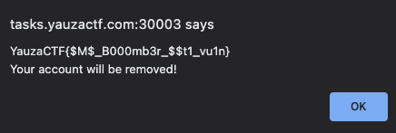

# Yauzabomber

## Description

http://tasks.yauzactf.com:30003/

Your task is to learn a new service for fast sending messages at

## Solution

### Unintended

The `.git` directory and source code were exposed on the webserver. In `app.py`, the flag is exposed.

```python
@app.route("/shop/", methods=['POST'])
@require_authorization
def shop_form(current_user):
    item_id = int(request.form.get('id'))
    user_obj, item_obj = db.ShopItem().buy_item(item_id, current_user.id)
    shop_items = db.ShopItem().list_items()

    if user_obj is None:
        return render_template("shop.html", shop_items=shop_items, error=1)

    if item_obj.phone == '+7777-(777)-777777':
        db.User().delete_login(current_user.login)
        return render_template("shop.html", shop_items=shop_items, flag='YauzaCTF{$M$_B000mb3r_$$t1_vu1n}')

    return render_template("shop.html", shop_items=shop_items, success=1)
```

### Intended

There is a vulnerability in the "new chat" feature.

```python
@app.route("/new_chat/", methods=['POST'])
@require_authorization
def new_chat(current_user):
    phone = str(request.form.get('phone'))
    message = str(request.form.get('message'))
    recaptchaResponse = str(request.form.get('g-recaptcha-response'))

    r = requests.post('https://www.google.com/recaptcha/api/siteverify',
                      data={
                          'secret': '6LcFLRccAAAAAJGO9V52-YxMiXkrKLmT4GBp9Ysf',
                          'response': recaptchaResponse,
                          'remoteip': '127.0.0.1',
                      })
    a = request.form
    j = r.json()

    if 'success' in j and j['success']:
        if not phone.startswith('+1337') and not phone.startswith('1337'):
            # sms message
            result = sms.send_sms(number='+' + re.sub("[^0-9]", "", phone), message=message, login=current_user.login, vulnfunc=db.User().add_money_to_login)
            if result:
                db.Message().send_sms(current_user, phone, message)
        else:
            # chat private message
            db.Message().send_private(current_user, phone, message)

    return redirect('/private/')
```

When sending an SMS to a number that does not begin with `+1337` or `1337`, the `send_sms` function in `sms.py` is called, with the keyword argument `vulnfunc=db.User().add_money_to_login`.

In the `send_sms` function, Flask's `render_template_string` function is used to generate the SMS message.

```python
def send_sms(number, message, login, vulnfunc):
    try:
        message = render_template_string('Hello from ' + login + ':\n{{ message }}', message=message, add_money_to_login=vulnfunc)
    except Exception as e:
        message = str(e)
    print(message)
    message = message[:160]
    r = requests.post(
        'https://api.twilio.com/2010-04-01/Accounts/AC8af1c9ea60578bbf05fcc8073785601d/Messages.json',
        data={
            'To': number,
            'MessagingServiceSid': 'MG2361073db2b525645c80023fbf791ff8',
            'Body': message
        },
        auth=HTTPBasicAuth('AC8af1c9ea60578bbf05fcc8073785601d', '43b98a2b0de062483f43e938112d9aa0')
    )
    print(number)
    j = r.json()
    print(j)
    return j['status'] == 'accepted' and not j['error_code']
```

The resulting template is user-controllable, since `login` is our username.

```python
'Hello from ' + login + ':\n{{ message }}'
```

We can then exploit Server-Side Template Injection \(SSTI\). Since the `add_money_to_login` function is added to the template context, we can manipulate the `login` variable to invoke this function. We essentially need two accounts, with one of the usernames being:

```python
{{ add_money_to_login(USERNAME, AMOUNT_OF_MONEY) }}
```



Then, when sending an SMS message, the following is called:

```python
render_template_string(
    'Hello from {{ add_money_to_login(USERNAME, AMOUNT_OF_MONEY) }}:\n{{ message }}', 
    message=message, 
    add_money_to_login=vulnfunc
)
```

When rendering the template, the `add_money_to_login` function is called, adding money to our other account.



Now that we have sufficient money, we can buy the flag!



