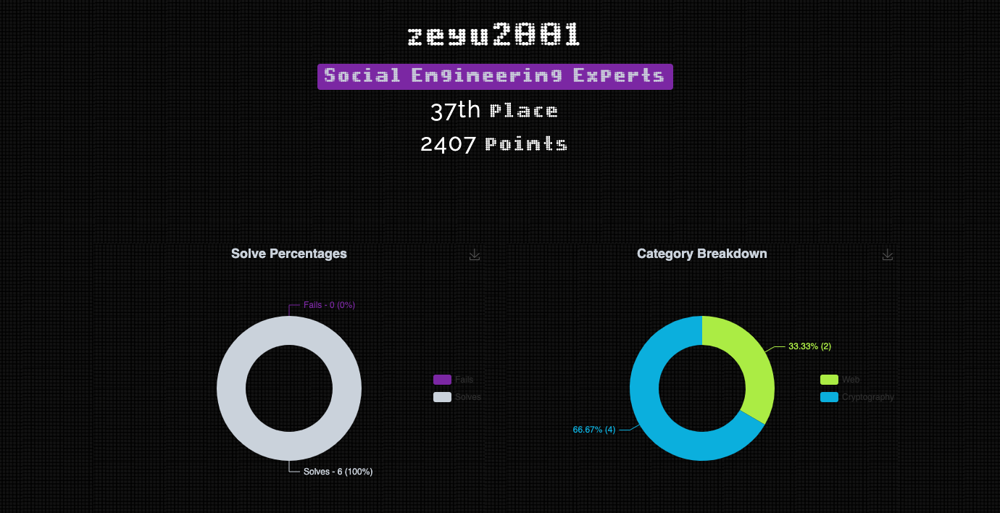

# Zh3ro CTF V2

## Web

* [sparta](sparta.md)
* [bxxs](bxxs.md)
* [Baby SSRF](baby-ssrf.md)

## Crypto

* [alice\_bob\_dave](alice_bob_dave.md)
* [chaos](chaos.md)
* [1n\_jection](1n_jection.md)
* [Twist and Shout](twist-and-shout.md)

## Results

We finished in 37th place.

I definitely learnt a thing or two from this, and they did Crypto justice!

