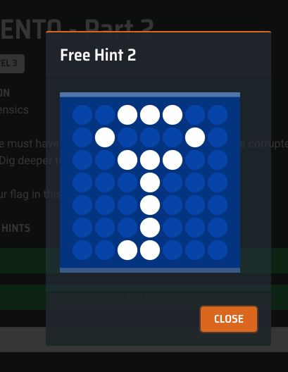

# Level 3 - PATIENT0

## Part 1

### Description

> Palindrome has spread some virus to corrupt machines causing incorrect readings in patients' health measurements and rending them unusable. Inspect the file and see if you can uncover the 8 corrupted bytes that renders the file system unusable?
>
> Submit your flag in this format: TISC{last 4 bytes in 8 lowercase hex characters}



### Solution

The first part of the challenge revolves around figuring out what the provided file is and fixing it.

We can see that this is an NTFS partition.


```
$ file PATIENT0 
PATIENT0: DOS/MBR boot sector, code offset 0x52+2, OEM-ID "NTFS    ", sectors/cluster 8, Media descriptor 0xf8, sectors/track 0, FAT (1Y bit by descriptor); NTFS, physical drive 0xab3566f7, sectors 12287, $MFT start cluster 4, $MFTMirror start cluster 767, bytes/RecordSegment 2^(-1*246), clusters/index block 1, serial number 05c66c6b160cddda1
```


If we attempt to mount it, we see an interesting error message.

```
$ sudo mount -t ntfs  ./PATIENT0 ./test
Reserved fields aren't zero (0, 0, 0, 0, 1129531732, 0).
Failed to mount '/dev/loop0': Invalid argument
The device '/dev/loop0' doesn't seem to have a valid NTFS.
Maybe the wrong device is used? Or the whole disk instead of a
partition (e.g. /dev/sda, not /dev/sda1)? Or the other way around?
```

It seems like `Reserved fields aren't zero (0, 0, 0, 0, 1129531732, 0)` is the root cause of the error. If we open the file up in a hex editor, we see that the string `TISC` corresponds to the bytes `0x43534954 = 1129531732`.

<figure><figcaption></figcaption></figure>

This definitely corresponds to at least 4 of the bytes that "render the file system unusable". If we take a look at the [NTFS Partition Boot Sector documentation](http://ntfs.com/ntfs-partition-boot-sector.htm), we would see that the bytes from offset `0x20` to `0x27` are fields in the BPB that are "not used by NTFS".

<figure><figcaption></figcaption></figure>

These 8 bytes are the corrupted bytes that should be patched to null bytes.

The flag for this part is thus `TISC{f76635ab}`

### Extra Stuff

I also found that by using `binwalk` on the NTFS file, we could find a PDF that contained a hint for this part.

<figure><figcaption></figcaption></figure>

## Part 2

### Description

> Palindrome must have leaked one of their passwords as the 4 corrupted bytes (Part 1 flag)! Dig deeper to find what was hidden!\
> \
> Submit your flag in this format: TISC{md5 hash} <-- will be prompted only after opening hidden room.\
> \
> Note: Please ignore the word 'original' in clue 4.

### Solution

#### Alternate Data Streams

Once we patched the 8 corrupted bytes to null bytes, we should be able to mount the NTFS partition.

<figure><figcaption></figcaption></figure>

Inside we find a `message.png` file containing a base32-encoded message.

<figure><figcaption></figcaption></figure>

Annoyingly this was an image instead of a text file...

```python
import pytesseract
from PIL import Image

img = Image.open('message.png')
text = pytesseract.image_to_string(img)
print(text)
```

This decodes to `2.Thirsty for the flag? Go find the stream.`

After spending close to an hour guessing what this meant (PDF stream object?), I realised that since we are working with NTFS, this must have meant Alternate Data Streams (ADS). ADS are a way to store different streams of data within the same file, and can be used to hide information that would not be normally discovered through a simple directory listing.

A bit of googling later, I figured out how to mount the NTFS partition while preserving the ADS.

```
$ ntfs-3g -o streams_interface=windows PATIENT0.ntfs ./test

$ getfattr -n ntfs.streams.list message.png
# file: message.png
ntfs.streams.list="$RAND"
```

#### TrueCrypt Shenanigans

Opening up the `$RAND` data stream of `message.png`, we are greeted with the next hint.

<figure><figcaption></figcaption></figure>

What I initially dismissed as bad grammar turned out to be crucial to this hint. The capitalized words spell TrueCrypt, which I doubt many people would have noticed if not for the following free hint that was released (showing the TrueCrypt logo).

<figure><figcaption></figcaption></figure>

At the end of the file was also the message `If you need a password, the original reading of the BPB was actually Checked and ReChecked 32 times!`

I downloaded TrueCrypt and decrypted the file (with the plaintext hints cut out) with the password `f76635ab` as hinted by the challenge description. This yielded yet another message.

<figure><figcaption></figcaption></figure>

#### Leetspeak Hangman

It turns out that TrueCrypt allows users to create[ hidden volumes](https://www.truecrypt71a.com/documentation/plausible-deniability/hidden-volume/). This is used in case a user is forced to reveal the password to a TrueCrypt volume, in which case they can provide the password to the standard volume while withholding the password to the hidden volume.

> TrueCrypt first attempts to decrypt the standard volume header using the entered password. If it fails, it loads the area of the volume where a hidden volume header can be stored (i.e. bytes 65536–131071, which contain solely random data when there is no hidden volume within the volume) to RAM and attempts to decrypt it using the entered password.

The previous message gives us a hangman riddle of sorts - we know that the word in question is "collision", but it seems like we need a leetspeak version of it. The message found in the previous part now becomes relevant - the password is a variation of the word "collision" that yields a CRC value of `0xf76635ab`.

> If you need a password, the original reading of the BPB was actually Checked and ReChecked 32 times!

After trying several failed variations, I just made `hashcat` attempt all possible permutations of a 9-letter alphanumeric word starting with 'c' and ending with 'n'

`hashcat -a 3 -m 11500 -1 abcdefghijklmnopqrstuvwxyz0123456789 "f76635ab:00000000" 'c?1?1?1?1?1?1?1n' -o found.txt --keep-guessing`

This gave many possible results, but `c01lis1on` was the only viable one.

#### PowerPoint Shenanigans

After decoding the hidden volume, we find a `.ppsm` file (a PowerPoint file with embedded macros). The one and only slide in the presentation told us the flag format.

<figure><figcaption></figcaption></figure>

There is an audio clip that was played when the slide enters presentation mode.

Since PowerPoint files were essentially zip archives, all we needed to do was unzip the `.ppsm` file and look for a `.mp3` file.

```
$ find . -name '*mp3'
./ppt/media/media1.mp3

$ cat ./ppt/media/media1.mp3 | md5
f9fc54d767edc937fc24f7827bf91cfe
```
