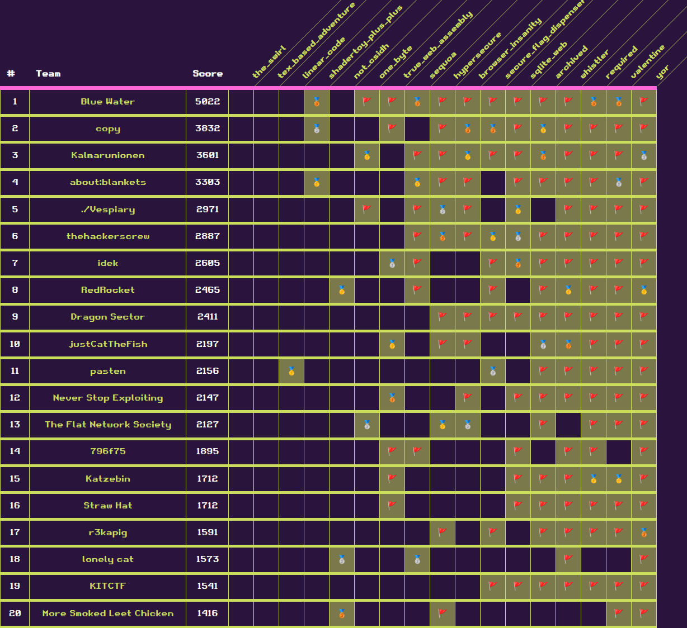

# hxp CTF

Won this CTF together with friends from [Blue Water](https://ctftime.org/team/205897) (Perfect Blue + Water Paddler).

<figure><figcaption></figcaption></figure>

We solved all the Web challenges in this CTF. All of them, except for _valentine_, were clone-to-pwn challenges requiring us to find a 0day in an open-source web application.

| Challenge                                     | Category | Target                                                              |
| --------------------------------------------- | -------- | ------------------------------------------------------------------- |
| valentine                                     | Web      | [ejs](https://github.com/mde/ejs)                                   |
| archived                                      | Web      | [Apache Archiva](https://github.com/apache/archiva)                 |
| sqlite\_web                                   | Web      | [sqlite-web](https://github.com/coleifer/sqlite-web)                |
| [true\_web\_assembly](true\_web\_assembly.md) | Web      | [AsmBB](https://board.asm32.info/asmbb-v2-9-has-been-released.328/) |
