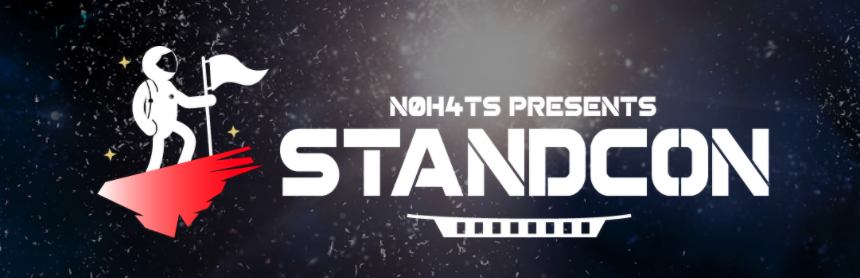

# STANDCON CTF 2021

Here are the solutions to my challenges for the STANDCON CTF, hosted by N0H4TS on 25 July. It was my first time writing challenges for a CTF, so please feel free to let me know if you have any feedback!

## Web

* [Space Station](space-station.md)
* [Star Cereal](star-cereal.md)
* [Star Cereal 2](star-cereal-2.md)

Space Station was a relatively simple challenge, requiring participants to identify an LFI vulnerability in the PHP-Proxy library. 

Star Cereal and Star Cereal 2 proved to be the more challenging. 

Star Cereal required knowledge of PHP deserialization and object injection, while Star Cereal 2 required some creative thinking to piece clues together. 

Star Cereal 2 went unsolved until the last hour of the CTF when additional hints were released.

## Pwn

* [Mission Control](mission-control.md)
* [Rocket Science](rocket-science.md)
* [Space University of Interior Design](space-university-of-interior-design.md)

Mission Control was a relatively simple challenge, requiring participants to overwrite a global variable through a format string vulnerability. 

Space University of Interior Design was a rather fun challenge, requiring participants to escalate privileges through SUID and SUDO misconfigurations. 

Rocket Science proved to be the most challenging. This challenge required participants to find information on the lambdaJSON library, read the source code, and exploit it independently.

## Cryptography

* [Rocket Ship Academy](rocket-ship-academy.md)
* [Space Noise](space-noise.md)

Rocket Ship Academy was a classic textbook RSA chosen-ciphertext attack.

Space Noise was a little more challenging, requiring participants to find patterns in the given PCAP file, and infer that a covert channel was implemented using morse code.

