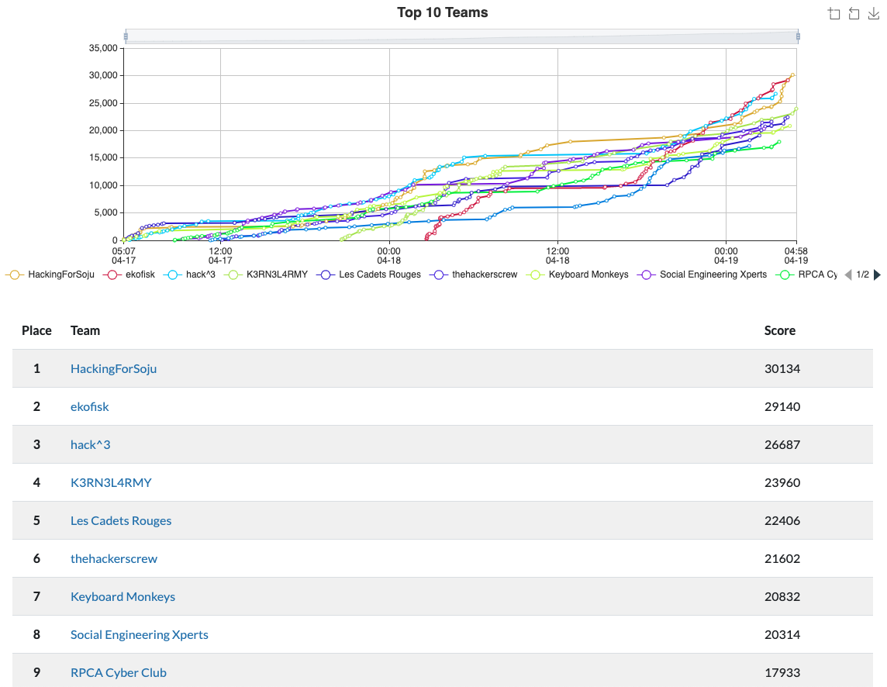
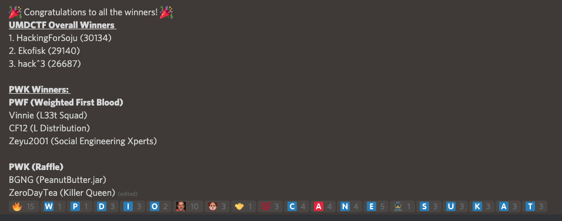
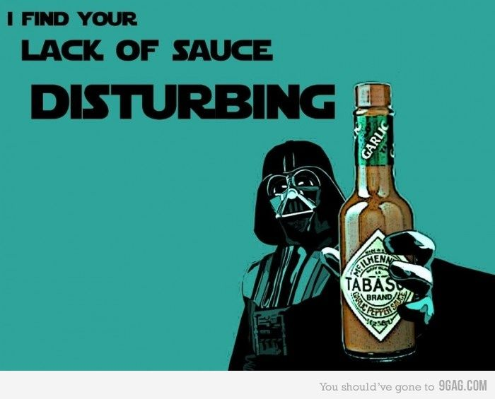

# UMDCTF 2021

## Writeups

### Advantageous Adventures

* [Advantageous Adventures](advantageous-adventures.md)

### Programming

* [Jay](jay.md)
* [Bomb 2 - Mix Up](bomb-2-mix-up.md)
* [L33t M4th](l33t-m4th.md)

### Crypto

* [Office Secrets](office-secrets.md)
* [To Be XOR Not To Be](to-be-xor-not-to-be.md)
* [Subway](subway.md)
* [Whose Base Is It Anyway](whose-base-is-it-anyway.md)
* [Cards Galore](cards-galore.md)

### Pwn

* [Jump Not Easy](jump-not-easy.md)

### Forensics

* [Donnie Docker](donnie-docker.md)
* [Pretty Dumb File](pretty-dumb-file.md)

### Stego

* [Roy's Randomness](roys-randomness.md)

## Results

8th overall on the final scoreboard!

Individually, I also won a PWK voucher, for having the 3rd most first bloods!

