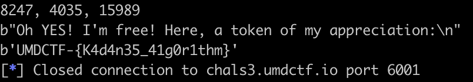
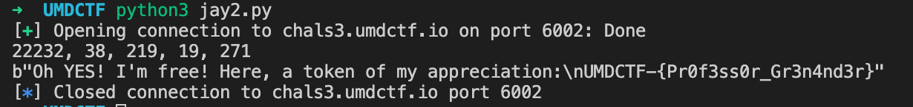

# Jay

## Jay 1

```text
I've been stuck in this room for some time now. They locked me in here and told
me the only way I can leave is if I solve their problem within five seconds.
I've tried so much, but my algorithm keeps going over the time. Can you help me?

What I have to do is find the maximum contiguous sub-array within this array of
numbers. They keep telling me my algorithm isn't efficient enough! If you can
send me the indices of this array, I might live to see another day.

Format: "sum, i, j" Example: 103, 345, 455

sum = the maximum contiguous sum
i = start index of sub-array
j = end index of sub-array

Press Enter to get the arr
```

This is the maximum contiguous subarray algorithm. Luckily, I had experience with this algorithm \(yay competitive programming!\). The only twist is we had to output the start and end indices.

```python
from pwn import *

conn = remote('chals3.umdctf.io', 6001)

conn.send('\n')
conn.recvuntil('[')
data = '[' + conn.recvuntil(']').decode()
print(data)

arr = eval(data)

max_so_far = 0
max_end_here = 0
curr_index = 0
curr_i = 0
i = 0
j = 0

while curr_index < len(arr):
    max_end_here += arr[curr_index]
    if max_end_here > max_so_far:
        max_so_far = max_end_here
        i = curr_i
        j = curr_index

    if max_end_here < 0:
        max_end_here = 0
        curr_i = curr_index + 1

    curr_index += 1

print(f"{max_so_far}, {i}, {j}")

conn.send(f"{max_so_far}, {i}, {j}")
conn.recvline()
conn.recvline()
print(conn.recvline())
print(conn.recv())

conn.close()
```



## Jay 2

```text
Welp that didn't work. As soon as they took me out of this place, they dragged me
to another room and told me to solve another stupid puzzle. You think you could help
me with this one as well? This was all they gave me:

"You are given a 2-dimensional array of values for an image. Find the
brightest subregion of the image (the bigger the number, the brighter). A subregion (rectangular) can range from one pixel to the whole
image. You can assume the image has the same width and height."

They also gave me an example for clarification:
|-----|-----|-----|-----|-----|
|     |     |     |     |     |
|  6  | -5  | -7  |  4  | -4  |
|     |     |     |     |     |
|-----|-----|-----|-----|-----|
|     |     |     |     |     |
| -9  |  3  | -6  |  5  |  2  |
|     |     |     |     |     |
|-----|-----|-----|-----|-----|
|     |     |     |     |     |
| -10 |  4  |  7  | -6  |  3  |
|     |     |     |     |     |
|-----|-----|-----|-----|-----|
|     |     |     |     |     |
| -8  |  9  | -3  |  3  | -7  |
|     |     |     |     |     |
|-----|-----|-----|-----|-----|

Format: "sum, row_start, row_end, col_start, col_end" Example: 17, 2, 3, 1, 2

sum = the maximum subregion sum
row_start = row index of top left
row_end = row index of bottom right
col_start = col index of top left
col_end = col index of bottom right

Press Enter to get the 2D array
```

The idea here is to apply the above algorithm for 1D arrays onto the 2D array, by treating the sum of each row of the subarea as an element in the 1D array. So, when finding the maximum contiguous sum of the "1D array", we are finding the optimal `row_start` and `row_end` for any combination of `col_start` and `col_end`,

```python
from pwn import *

def longest_contiguous_subarray(arr):

    max_so_far = 0
    max_end_here = 0
    curr_index = 0
    curr_i = 0
    i = 0
    j = 0

    while curr_index < len(arr):
        max_end_here += arr[curr_index]
        if max_end_here > max_so_far:
            max_so_far = max_end_here
            i = curr_i
            j = curr_index

        if max_end_here < 0:
            max_end_here = 0
            curr_i = curr_index + 1

        curr_index += 1

    return max_so_far, i, j

conn = remote('chals3.umdctf.io', 6002)

conn.send('\n')
conn.recvuntil('[')
data = '[' + conn.recvuntil(']]').decode()
#print(data)

arr = eval(data)

"""
arr = [
    [6, -5, -7, 4, -4],
    [-9, 3, -6, 5, 2],
    [-10, 4, 7, -6, 3],
    [-8, 9, -3, 3, -7],
]
"""

max_sum = 0
max_row_start = 0
max_row_end = 0
max_col_start = 0
max_col_end = 0


col_start = 0
while col_start < len(arr[0]):

    new_arr = [0 for i in range(len(arr))]

    col_end = col_start
    while col_end < len(arr[0]):

        for i in range(len(arr)):
            # Note that we can only add the entire subrow, since the subregion must be rectangular
            # Each element in the new array represents the sum of a subrow
            new_arr[i] += arr[i][col_end]
        # print(new_arr)

        subarray_sum, row_start, row_end = longest_contiguous_subarray(new_arr)
        if subarray_sum > max_sum:
            max_sum = subarray_sum
            max_row_start = row_start
            max_row_end = row_end
            max_col_start = col_start
            max_col_end = col_end

        col_end += 1

    col_start += 1


conn.recvline()
conn.recvline()
print(f"{max_sum}, {max_row_start}, {max_row_end}, {max_col_start}, {max_col_end}")
conn.send(f"{max_sum}, {max_row_start}, {max_row_end}, {max_col_start}, {max_col_end}")
print(conn.recv())

conn.close()
```



