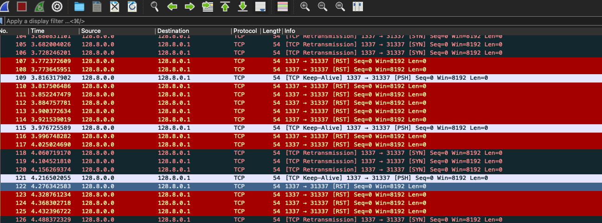
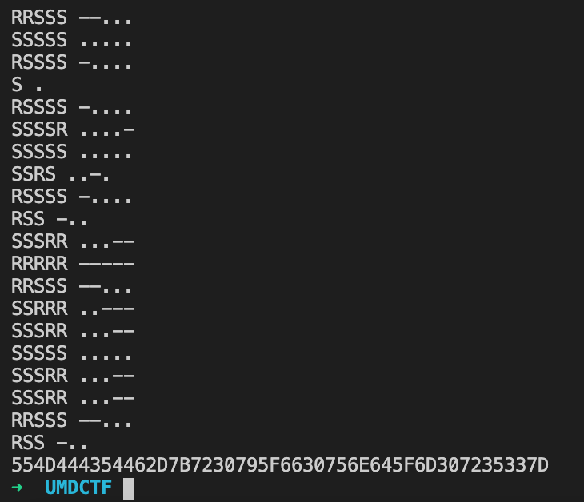

# Roy's Randomness

## Problem

Roy found some suspicious network traffic, wireshark shows so many errors with it! Can you figure out what's happening

## Solution

This is a TCP covert channel, using morse code.



The `PSH` packets are sent at regular intervals, serving as delimiters.

On the other hand, the `RST` and `SYN` packets act as '1' and '0' bits in the message. Using the international morse code, `RST -> -` and `SYN -> .`, we can obtain the message.



Decoding from hex gives us the flag: UMDCTF-{r0y\_f0und\_m0r53}

```python
import json

MORSE_CODE_DICT = { 'A':'.-', 'B':'-...',
                    'C':'-.-.', 'D':'-..', 'E':'.',
                    'F':'..-.', 'G':'--.', 'H':'....',
                    'I':'..', 'J':'.---', 'K':'-.-',
                    'L':'.-..', 'M':'--', 'N':'-.',
                    'O':'---', 'P':'.--.', 'Q':'--.-',
                    'R':'.-.', 'S':'...', 'T':'-',
                    'U':'..-', 'V':'...-', 'W':'.--',
                    'X':'-..-', 'Y':'-.--', 'Z':'--..',
                    '1':'.----', '2':'..---', '3':'...--',
                    '4':'....-', '5':'.....', '6':'-....',
                    '7':'--...', '8':'---..', '9':'----.',
                    '0':'-----', ', ':'--..--', '.':'.-.-.-',
                    '?':'..--..', '/':'-..-.', '-':'-....-',
                    '(':'-.--.', ')':'-.--.-'}

data = json.loads(open('roy.json').read())
result = ''

curr = ''
for packet in data:
    flags = packet['_source']['layers']['tcp']['tcp.flags_tree']

    if flags['tcp.flags.syn'] == '1':
        curr += 'S'

    elif flags['tcp.flags.push'] == '1':

        if not curr:
            continue

        morse_code = ''
        for char in curr:
            if char == 'R':
                morse_code += '-'
            else:
                morse_code += '.'

        print(curr, morse_code)

        for key in MORSE_CODE_DICT:
            if MORSE_CODE_DICT[key] == morse_code:
                result += key

        curr = ''

    elif flags['tcp.flags.reset'] == '1':
        curr += 'R'

print(result)
```

