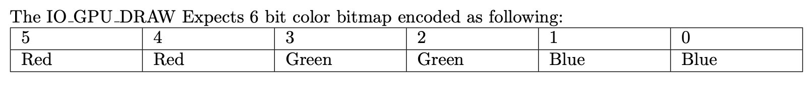

# ARC6969 Pt. 2

## Description

The ARC6969 is an old and forgotten architecture used in a military computers during Cold War. Although we don't have the computers anymore, we got CPU manual and a few programs.





## Solution

This is an extension from [ARC6969 Pt .1](arc6969-pt.-1.md). This time, the GPU is being used.

Each pixel of the GPU is represented by a 6-bit color bitmap:



Since each of the R, G and B colors are represented by only 2 bits, we have to scale this to match the normal 8-bit RGB channels. This means that `0b01` would correspond to 85, `0b10` would correspond to 170, and `0b11` would correspond to 255 on the 0 to 255 scale.

We then build on top of the script from [ARC6969 Pt .1](arc6969-pt.-1.md), implementing the `update_screen` function.

```python
gpu = [[0 for _ in range(64)] for _ in range(32)]
gpu_x = 0
gpu_y = 0

videodims = (64, 32)
fourcc = cv2.VideoWriter_fourcc(*'avc1')    
video = cv2.VideoWriter("test.mp4",fourcc, 60,videodims)

def update_screen(gpu):

    img = Image.new( 'RGB', (64, 32), "black") # Create a new black image

    step = 255 // 3 # 2 bits per color -> 2 ** 2 = 4 values

    pixels = img.load()
    for x in range(img.size[0]):
        for y in range(img.size[1]):
            gpu_pixel = gpu[y][x]
            r = ((gpu_pixel & 0b110000) >> 4) * step
            g = ((gpu_pixel & 0b001100) >> 2) * step
            b = (gpu_pixel & 0b000011) * step
            pixels[x, y] = (r, g, b)
        
    video.write(cv2.cvtColor(np.array(img), cv2.COLOR_RGB2BGR))
```

Each time the `IO_GPU_UPDATE` instruction is executed, the frame is added to the output video.


The final video contains the flag: `YauzaCTF{SW0RDFISH}`.

