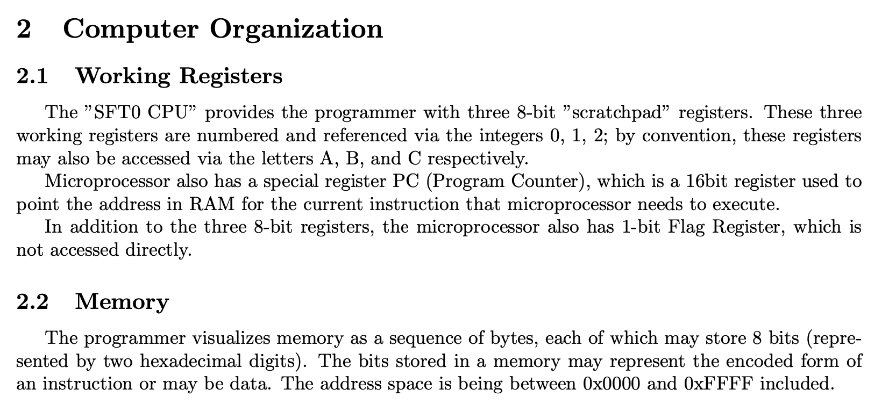
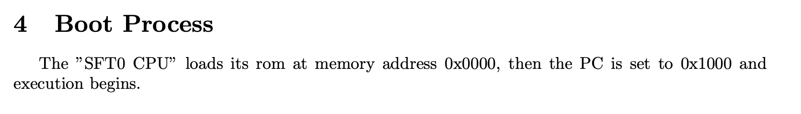
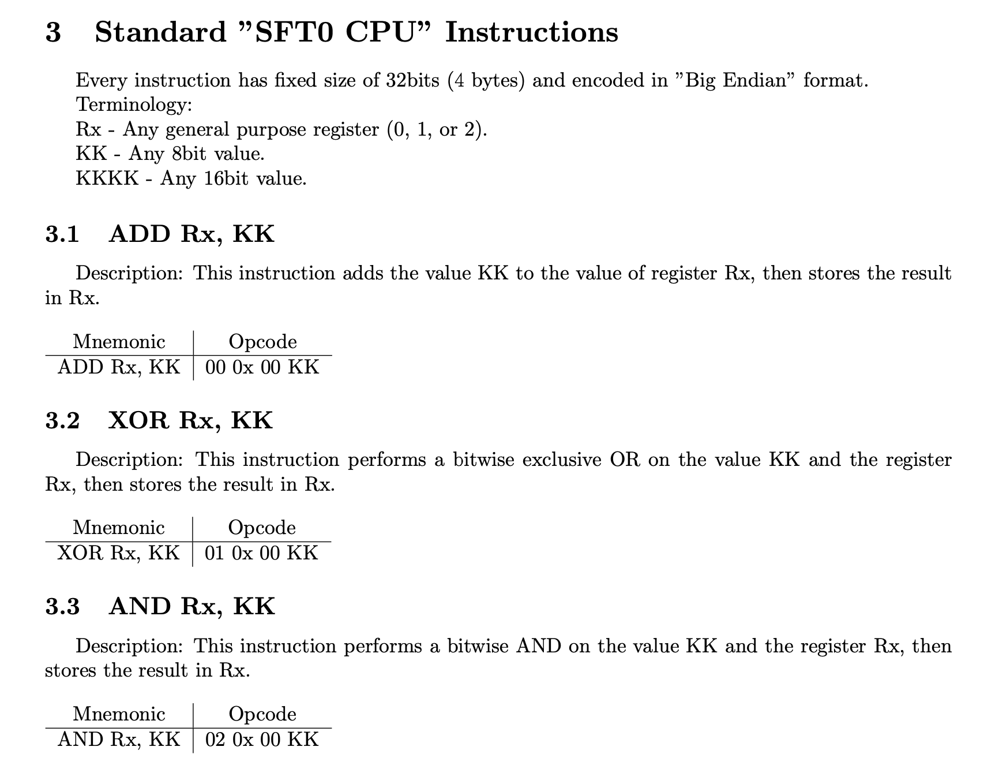

# RISC 8bit CPU

## Description

The SFT0 CPU is a secure processor designed to store encryption key. Find out how the processor works and get the key.





## Solution

We're given the specifications for this custom processor. This one is pretty simple - there are 3 registers \(A, B and C\), a program counter \(PC\) and a 1-bit flag register.



We're told that the address space is from 0x0000 to 0xFFFF. Furthermore, the PC starts from 0x1000:



We're given the ROM to be loaded at 0x0000, and we need to write an emulator that parses and executes the following instructions.



We can simply represent the memory space as an array, access 4 bytes at a time, and parse the instructions based on the specification above. Initially, I ran into some errors because I forgot to always take the lower 8 bits after an arithmetic operation. The rest is just a bunch of if-else statements!

```python
ROM = "40 18 2C ... 09 09 09"

registers = [0 for _ in range(3)]

pc = 0x1000     # Program Counter
fr = 0          # Flag Register

rom = [int(x, 16) for x in ROM.split()]
memory = rom + [0 for _ in range(0xffff + 1 - len(rom))]

done = False
while not done:

    curr_instruction = memory[pc:pc+4]
    pc += 4

    if curr_instruction[0] == 0:
        # print(f"ADD R{curr_instruction[1]}, {curr_instruction[3]}")

        registers[curr_instruction[1]] += curr_instruction[3]

    elif curr_instruction[0] == 1:
        # print(f"XOR R{curr_instruction[1]}, {curr_instruction[3]}")

        registers[curr_instruction[1]] ^= curr_instruction[3]
    
    elif curr_instruction[0] == 2:
        # print(f"AND R{curr_instruction[1]}, {curr_instruction[3]}")

        registers[curr_instruction[1]] &= curr_instruction[3]
    
    elif curr_instruction[0] == 3:
        # print(f"OR R{curr_instruction[1]}, {curr_instruction[3]}")

        registers[curr_instruction[1]] |= curr_instruction[3]

    elif curr_instruction[0] == 4:
        # print(f"LD R{curr_instruction[1]}, {curr_instruction[3]}")

        registers[curr_instruction[1]] = curr_instruction[3]
    
    elif curr_instruction[0] == 5:
        # print(f"MOV R{curr_instruction[1]}, R{curr_instruction[3]}")

        registers[curr_instruction[1]] = registers[curr_instruction[3]]

    elif curr_instruction[0] == 6:

        addr = 256 * curr_instruction[2] + curr_instruction[3]

        # print(f"LDR R{curr_instruction[1]}, {addr}")

        registers[curr_instruction[1]] = memory[addr]

    elif curr_instruction[0] == 7:
        # print(f"LDR R{curr_instruction[1]}")

        addr = 256 * registers[1] + registers[2]
        registers[curr_instruction[1]] = memory[addr]
    
    elif curr_instruction[0] == 8:
        
        addr = 256 * curr_instruction[2] + curr_instruction[3]

        # print(f"STR R{curr_instruction[1]}, {addr}")

        memory[addr] = registers[curr_instruction[1]]

    elif curr_instruction[0] == 9:
        # print(f"STR R{curr_instruction[1]}")

        addr = 256 * registers[1] + registers[2]      
        memory[addr] = registers[curr_instruction[1]]

    elif curr_instruction[0] == 0x0A:
        # print(f"PUT R{curr_instruction[1]}")

        print(chr(registers[curr_instruction[1]]), end='')
    
    elif curr_instruction[0] == 0x0B:
        
        addr = 256 * curr_instruction[2] + curr_instruction[3]

        # print(f"JMP {addr}")

        pc = addr

    elif curr_instruction[0] == 0x0C:

        addr = 256 * curr_instruction[2] + curr_instruction[3]

        # print(f"JNZ {addr}")

        if fr == 0:
            pc = addr + 4
    
    elif curr_instruction[0] == 0x0D:
        
        addr = 256 * curr_instruction[2] + curr_instruction[3]

        # print(f"JZ {addr}")

        if fr == 1:
            pc = addr + 4

    elif curr_instruction[0] == 0x0E:
        # print(f"CMPEQ R{curr_instruction[1]}, {curr_instruction[3]}")

        if registers[curr_instruction[1]] == curr_instruction[3]:
            fr = 1
        
        else:
            fr = 0
    
    elif curr_instruction[1] == 0x44:
        # print("HLT")

        done = True
    
    elif curr_instruction[1] == 0x33:
        # print("NOP")
        pass

    else:
        raise ValueError(f"Unrecognized instruction {curr_instruction}")
    
    # 8-bit
    for i in range(len(registers)):
        if registers[i] >= 256:
            registers[i] -= 256
    
    # 16-bit
    if pc >= 65536:
        pc -= 65536
```

The flag is `YauzaCTF{s0_s3cr3t_y3t_s0_fr33}`.


