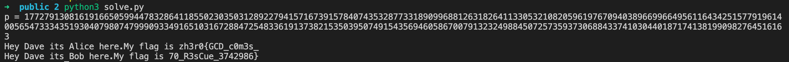

# alice\_bob\_dave

## Problem

Alice and Bob are sending their flags to Dave. But sadly Dave lost the modulus :\( Try to retrieve the flag!

## Solution

We are given the following source code:

```python
from Crypto.Util.number import *
from secret import msg_a,msg_b

e=65537
p,q,r=[getStrongPrime(1024,e) for _ in range(3)]
pt_a=bytes_to_long(msg_a)
pt_b=bytes_to_long(msg_b)

n_a=p*q
n_b=p*r
phin_a=(p-1)*(q-1)
phin_b=(p-1)*(r-1)
d_a=inverse(e,phin_a)
d_b=inverse(e,phin_b)

ct_a=pow(pt_a,e,n_a)
ct_b=pow(pt_b,e,n_b)

print(f"{ct_a=}\n{ct_b=}\n{d_a=}\n{d_b=}\n{e=}")
```

And the output:

```text
ct_a=1991374644522844726604723395302447678829362766488998002689642863876589167224123634868869407586265887639572846618361378190717796457675877867002990630200549839187693737176043693114429036857443618075597595356236777647214186597416429862630588853297534066191784060030827904725960955181749644590885127762513958644117342351741609981560458367036971039921421548984093411630930209440031060634872093143755813835906517674672118355461511837533783279547447855290393938723966500874359457216314821548439555245649159786182924722770460929014017979622168454175758261065999271764594369618940918533185330319317089809708951104047147411596
ct_b=11560415492145861207516424108577715664730529386805857287246533744961821151018194362544284902991666685182413092786353089517543091603274250128250910669110530206320138191614471688310529571895441809729559056935543845898702106837033971935287923495445981173899073238286288875669342754013550227359718814123485311705960547980778357375585882146296937739196745327987012437076826111202650212821723168353665944362122152786549834258495316372518691633486765982945106049194892430437710982481105051765183397588927444843790029563399175420351710322220501327577415113508236805750358567711052779340011355629159610689505604941700815518380
d_a=12007894588345817095001901772235818535532128075248502006167506715501613386280619988757005912270381074208611126718938214462213079931302423653355153363846803336576965899104058007549509604040316897464770127372797630135493394807353800174267249408200186888724103432412296802728616667116382243738519746110159825921676647202689661952040602841752466515868580858475210918168761862255041985423595605698941150797550252491451770611246462256935118062094973933183288422900540413805923476283359196218128607678993284504582128505198491110084905108072190837781925478455984417366202863689318005069821086805269764308054632708127147397685
d_b=15309121030008789112453654624398278092026139678301334759817236349957760197277968332173160272007689043235997494440248487531238644015060915059836861728115118555482791561589562225055947155368216166612774271639118879220806859714069050410034235487298164832205885978355955618431606156727831992132535894020870312453902803351757466444078059503362362343138846985263572980446344678973847354860739168547872456538618897496981232096868408852088578700314051200160980186449222946973789039336701174360592471866811887750298968395798446811465432587371913161943176018766518394820191044593922558127924048562996714970537749736086175516533
e=65537
```

Notice the way that the modulus is chosen. Three primes \(p, q, and r\) are chosen. The first modulus is $$n_a=p\times q$$ , and the second is $$n_b=p\times r$$.

Our first observation should be that both moduli share $$p$$ as a common factor.

Recall that in RSA, for $$n=p\times q$$, the private exponent$$d$$ is chosen such that

$$
ed\equiv1\pmod{\text{lcm}(p-1,q-1)}
$$

i.e. for some$$k\in\mathbb{Z}$$,

$$
ed=1+k(p-1)(q-1)
$$

For $$n_a=p\times q$$ and $$n_b=p\times r$$,

$$
ed_a-1=k_a(p-1)(q-1) \newline
ed_b-1=k_b(p-1)(r-1)
$$

Since we are given $$e$$, $$d_a$$ and $$d_b$$, we know the values of $$k_a(p-1)(q-1)$$ and $$k_b(p-1)(r-1)$$. It is trivial to deduce that the greatest common divisor \(GCD\) between these two values is a multiple of $$(p-1)$$. Let's call this $$\alpha(p-1)$$. 

We can write the following code to obtain $$\alpha(p-1)$$:

```python
from decimal import *
getcontext().prec = 1000

def gcd(a, b):
    while b:
        a, b = b, a % b
    return a
    
de_a = d_a * e
de_b = d_b * e
p_multiple = Decimal(gcd(de_a - 1, de_b - 1))
```

We could then iteratively test for the value of $$\alpha$$ by asserting that $$p$$ must be prime.

```python
def isPrime(n, k=5): # miller-rabin
    from random import randint
    if n < 2: return False
    for p in [2,3,5,7,11,13,17,19,23,29]:
        if n % p == 0: return n == p
    s, d = 0, n-1
    while d % 2 == 0:
        s, d = s+1, d//2
    for i in range(k):
        x = pow(randint(2, n-1), d, n)
        if x == 1 or x == n-1: continue
        for r in range(1, s):
            x = (x * x) % n
            if x == 1: return False
            if x == n-1: break
        else: return False
    return True

for i in range(2, 100):
    p = Decimal(p_multiple) / Decimal(i) + 1
    if isPrime(int(p)):
        print('p =', p)
        break
```

After finding $$p$$, we simply note that

$$
\frac{ed_a-1}{p-1}=k_a(q-1)
$$

and use a similar method to find $$q$$. Then, we attempt to decode the ciphertext:

$$
p_a=(c_a)^d\mod{n}
$$

```python
q_multiple = Decimal(de_a - 1) / (p - 1)

for i in range(2, 100000):
    q = Decimal(q_multiple) / Decimal(i) + 1
    if isPrime(int(q)):
        m = pow(int(ct_a), int(d_a), int(p) * int(q))
        msg = long_to_bytes(m)
        try:
            print(msg.decode())
            break
        except:
            continue
```

The method to find $$r$$ and decode the second part of the flag is exactly the same.

```python
r_multiple = Decimal(de_b - 1) / (p - 1)
for i in range(2, 100000):
    r = Decimal(r_multiple) / Decimal(i) + 1
    if isPrime(int(r)):
        m = pow(int(ct_b), int(d_b), int(p) * int(r))
        msg = long_to_bytes(m)
        try:
            print(msg.decode())
            break
        except:
            continue
```

Here's the output:



